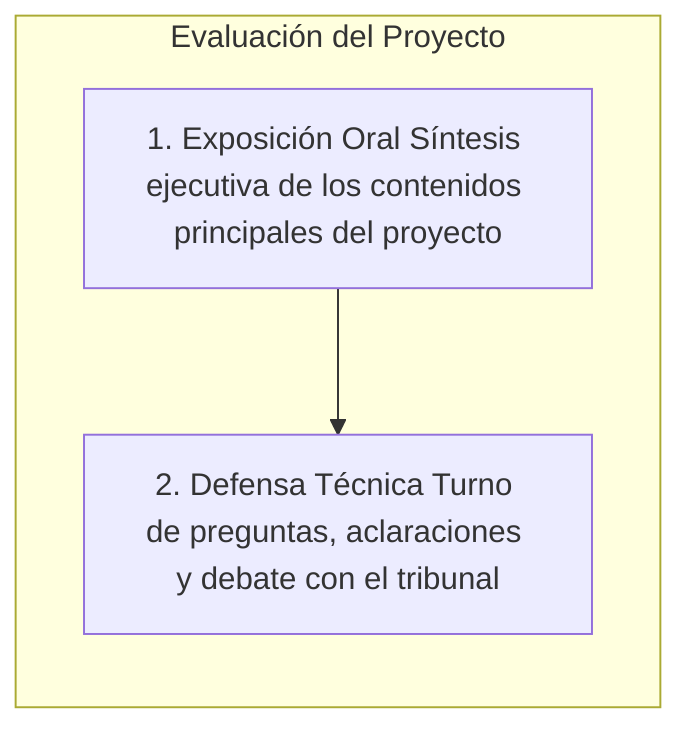

# 🚀 Elaboración de la Memoria, Exposición y Defensa del Proyecto

> **Módulo Profesional:** Proyecto Intermodular / Proyecto Integrado (DAM / DAW / ASIR)  
> **Fuente de Referencia:** Guía Oficial de Presentación y Exposición de Proyectos  
> **Finalidad:** Proporcionar al alumnado las pautas, recomendaciones técnicas y mejores prácticas para la redacción de la memoria escrita, la realización de la exposición oral y la defensa ante el tribunal evaluador.

---

## 📋 Índice
1. [Elaboración del Documento-Memoria del Proyecto](#1-elaboración-del-documento-memoria-del-proyecto)
2. [Estructura y Fases del Proceso de Evaluación](#2-estructura-y-fases-del-proceso-de-evaluación)
3. [Preparación de la Exposición Oral](#3-preparación-de-la-exposición-oral)
4. [Desarrollo de la Exposición Oral](#4-desarrollo-de-la-exposición-oral)
5. [Defensa del Proyecto y Turno de Preguntas](#5-defensa-del-proyecto-y-turno-de-preguntas)

---

## 1. Elaboración del Documento-Memoria del Proyecto

El documento-memoria es el soporte escrito en el que se plasma el trabajo realizado por el alumno/a o equipo. Debe redactarse teniendo en cuenta que será evaluado por el profesorado y que servirá de base para la defensa oral.

### 📝 Recomendaciones de Redacción y Formato
* **Claridad y Concreción:** Redactar los contenidos de forma directa, estructurada y sin rodeos innecesarios.
* **Enfoque al Lector Externo:** Explicar cada apartado asumiendo que quien lee la memoria no ha participado en su diseño. Los contenidos deben entenderse perfectamente de forma autónoma.
* **Sintaxis Eficiente:** Utilizar frases y párrafos cortos para evitar perder el hilo conductor de las ideas explicadas.
* **Corrección Lingüística:** Cuidar rigurosamente la ortografía, la gramática y el estilo técnico profesional.
* **Formato de Presentación:** Presentar el documento procesado a ordenador, impreso a una sola cara en formato DIN A4 (o en formato PDF estandarizado según indicación del centro).
* **Homogeneidad Estilística:** En proyectos desarrollados en grupo, revisar y unificar el tipo de letra, tamaños, formato de párrafos, márgenes e interlineado para garantizar un aspecto visual uniforme en todo el documento.
* **Revisión Final Externa:** Antes de la entrega definitiva, realizar una relectura completa del documento. Es altamente recomendable solicitar a una persona ajena al proyecto que lea la memoria para detectar pasajes confusos o faltas de claridad.

---

## 2. Estructura y Fases del Proceso de Evaluación

El acto final de evaluación del proyecto consta de dos momentos claramente diferenciados:

1. **La Exposición Oral:** Presentación pública sintética en la que el alumno/a o equipo describe los aspectos esenciales de la solución desarrollada.
2. **La Defensa Técnica:** Turno posterior de preguntas y respuestas donde el tribunal formula cuestiones para aclarar puntos de la memoria o verificar el grado de conocimiento individual y colectivo.

---

## 3. Preparación de la Exposición Oral

Una preparación previa rigurosa es fundamental para garantizar el éxito de la exposición pública.

### 🎯 Pautas de Preparación y Organización
* **Síntesis Ejecutiva:** La exposición **no consiste en leer la memoria**, sino en seleccionar y exponer únicamente una síntesis con los hitos y resultados principales.
* **Reparto Equitativo de Roles:** En exposiciones grupales, coordinar previamente la intervención de cada participante para que todos los miembros expongan una parte equivalente del trabajo.
* **Ensayos Reales y Medios Técnicos:** Ensayar la presentación utilizando exactamente el mismo equipamiento (portátil, proyector, software de presentación) para anticipar incompatibilidades, corregir fallos y ajustar el discurso.
* **Reserva de Equipos Electrónicos:** Comprobar y asegurar con antelación la disponibilidad de los recursos audiovisuales requeridos (cañón de vídeo, portátiles, adaptadores, pizarra digital, etc.).

### 🖼️ Materiales de Apoyo Recomendados
* **Presentación de Diapositivas:**
  * Evitar diapositivas recargadas de texto o con tipografía excesivamente pequeña.
  * Priorizar el uso de **esquemas, diagramas de arquitectura, fotografías, tablas y capturas visuales**.
  * Utilizar animaciones únicamente si aportan claridad explicativa, evitando el exceso para no ralentizar el ritmo.
* **Esquema-Guión para el Tribunal:** Elaborar e imprimir un guión estructurado de la presentación para entregarlo a los evaluadores al inicio de la sesión, facilitando el seguimiento de la exposición.
* **Demostración Práctica / Modelos:** Llevar prototipos, productos finales, dispositivos IoT o maqueta funcional que sirvan como evidencia visual del resultado.

---

## 4. Desarrollo de la Exposición Oral

Durante la exposición, la actitud, la comunicación verbal y la comunicación no verbal influyen directamente en la valoración del tribunal.

### 🗣️ Expresión Verbal y Discurso
* **Claridad y Proyección:** Hablar con volumen adecuado, vocalización limpia y un ritmo fluido sin acelerarse.
* **Modulación del Tono:** Variar el tono de voz para mantener la atención, enfatizando las ideas clave, los retos superados y los logros del proyecto.
* **Presentación Amena y Entusiasmo:** Proyectar pasión y convicción por la solución desarrollada; el entusiasmo del ponente motiva al tribunal y despierta su interés.

### 👁️ Expresión No Verbal y Postura Corporal
* **Contacto Visual Continuo:** Mantener la mirada en los miembros del tribunal y el público. Si se consulta una nota puntual, volver a levantar la mirada de inmediato.
* **Postura Erguida y Dinámica:** Realizar la exposición **de pie**. Estar de pie otorga dinamismo y mejora la proyección de la voz.
* **Evitar Posturas Inadecuadas:** No sentarse, no apoyarse o recostarse sobre las mesas y no meter las manos en los bolsillos.
* **Cierre Argumentado:** Aprovechar los instantes finales de la exposición para reforzar la viabilidad técnica, económica y operativa de la propuesta.

---

## 5. Defensa del Proyecto y Turno de Preguntas

El turno de defensa es la oportunidad para consolidar la nota y demostrar la autoría real y el dominio técnico sobre la materia.

### 💡 Pautas de Actuación durante las Preguntas
* **Demostración de Dominio:** Responder preferentemente **de memoria** a las cuestiones planteadas, proyectando seguridad, soltura y control sobre el proyecto.
* **Gestión de Dudas o Preguntas Confusas:** Si una pregunta no se comprende bien, solicitar con educación al tribunal que la repita o la formule de otra manera. Nunca responder con evasivas, hablar de temas no relacionados ni quedarse en silencio.
* **Material de Consulta Organizado:** Disponer de fichas esquemáticas, notas de respaldo y la memoria impresa con separadores organizados. Si los nervios requieren consultar un dato concreto, se podrá localizar de forma rápida sin perder la calma.
* **Enfoque Positivo de las Preguntas:** Considerar cada intervención del profesorado como una **invitación a ampliar la información** de la memoria, demostrando la madurez técnica del alumno/a y la solidez del trabajo realizado.
