# 🚀 RA1. Identifica necesidades del sector productivo, relacionándolas con proyectos tipo que puedan satisfacerlas.

> **Módulo Profesional:** Proyecto Intermodular / Proyecto Integrado (DAM / DAW / ASIR)  
> **Fase del Proyecto:** Kick-off & Sprint 1 | **Entregable:** Memoria Incremental v1.0  
> **Rol del Alumno/a:** *Architect / Technical Lead / Lead Developer / DevOps / SecOps / SysAdmin* (Responsable Único del Proyecto)
> **Rol del Docente:** *PMP / Guía Metodológico / Orientador Técnico y Evaluador / Tribunal*

---

## 📋 Índice
1. [Enfoque del Proyecto](#1-enfoque-del-proyecto)
2. [Ciclo de Vida Incremental del Proyecto](#2-ciclo-de-vida-incremental-del-proyecto)
3. [Prerrequisito Obligatorio: Kick-off y Anteproyecto](#3-prerrequisito-obligatorio-kick-off-y-anteproyecto)
4. [Desglose Criterio por Criterio (CE.a al CE.i)](#4-desglose-criterio-por-criterio-cea-al-cei)
   - [CE.a — Clasificación del Sector y Entorno de Aplicación](#ce-a--clasificación-del-sector-y-entorno-de-aplicación)
   - [CE.b — Estructura Organizativa y Roles Técnicos](#ce-b--estructura-organizativa-y-roles-técnicos)
   - [CE.c — Detección de Necesidades y Dolencias](#ce-c--detección-de-necesidades-y-dolencias)
   - [CE.d — Valoración de Oportunidades y Viabilidad Tridimensional](#ce-d--valoración-de-oportunidades-y-viabilidad-tridimensional)
   - [CE.e — Definición de la Tipología de Proyecto y Alcance](#ce-e--definición-de-la-tipología-de-proyecto-y-alcance)
   - [CE.f — Ingeniería de Requisitos y Elección Justificada del Stack](#ce-f--ingeniería-de-requisitos-y-elección-justificada-del-stack)
   - [CE.g — Marco Legal, Fiscal, Laboral, PRL y Ciberseguridad](#ce-g--marco-legal-fiscal-laboral-prl-y-ciberseguridad)
   - [CE.h — Ayudas, Subvenciones e Incentivos a la Innovación](#ce-h--ayudas-subvenciones-e-incentivos-a-la-innovación)
   - [CE.i — Guion de Trabajo, Backlog y Metodología Ágil](#ce-i--guion-de-trabajo-backlog-y-metodología-ágil)
5. [Ejecución Práctica según la Naturaleza del Proyecto](#5-ejecución-práctica-según-la-naturaleza-del-proyecto)
6. [Matriz de Entregables en Moodle y Demo Funcional Presencial](#6-matriz-de-entregables-en-moodle-y-demo-funcional-presencial)
7. [Checklist de Autoevaluación para el Alumnado](#7-checklist-de-autoevaluación-para-el-alumnado)

---

## 1. Enfoque del Proyecto

El módulo de Proyecto contempla cualquier tipología de solución tecnológica que el alumno/a decida desarrollar, adaptando los fundamentos de la gestión de proyectos de ingeniería a las distintas áreas y especialidades del sector:

* **Desarrollo de Software Multiplataforma (DAM):** Aplicaciones móviles nativas (Kotlin, Swift) y soluciones multiplataforma (Flutter, React Native, Compose Multiplatform), aplicaciones de escritorio híbridas (Electron, Tauri), Progressive Web Apps (PWA), integración de IA local en dispositivo (*On-device AI*) o desarrollo para sistemas embebidos e IoT (Rust, MicroPython).
* **Desarrollo de Aplicaciones Web (DAW):** Plataformas web SaaS, arquitecturas Full-Stack / SSR / Serverless (Next.js, Nuxt, SvelteKit), Progressive Web Apps (PWA), microservicios, APIs (REST, GraphQL, gRPC) e integración de servicios de Inteligencia Artificial Generativa y RAG.
* **Administración de Sistemas Informáticos y Redes (ASIR):** Infraestructuras cloud y multi-cloud (AWS, Azure, GCP), virtualización (Proxmox, VMware), contenedores y orquestación (Docker, Kubernetes/K3s), Infraestructura como Código (Terraform, Ansible), redes WAN/SD-WAN, ciberseguridad Zero-Trust, observabilidad y servicios gestionados.

---

## 2. Ciclo de Vida Incremental del Proyecto

A lo largo del curso, el alumno/a redacta un **único documento maestro (Memoria Incremental)** que evoluciona por versiones desde la `v1.0` hasta la `v4.0 FINAL`, acompañado en cada fase por una demostración práctica.

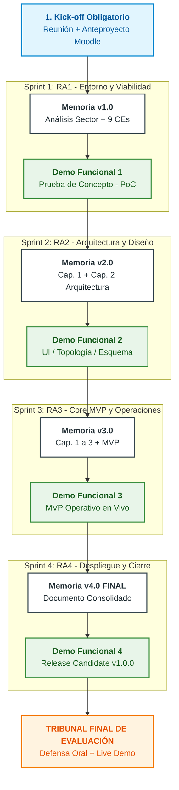

---

## 3. Prerrequisito Obligatorio: Kick-off y Anteproyecto

Antes de comenzar a redactar el Sprint 1 o desarrollar código/configuraciones, el alumno/a debe cumplir con la fase previa de **Kick-off**:

1. **Iniciativa de la Reunión Previa:** Es responsabilidad del alumno/a solicitar y agendar una reunión individual con el profesor/a para exponer verbalmente la idea, alcance preliminar y recursos. El docente actúa como orientador y guía.
2. **Redacción y Subida del Anteproyecto:** Elaborar el documento inicial con los apartados obligatorios (*Título, Descripción/Objetivos, Método/Fases, Medios/Recursos, Bibliografía y Declaración de Autoría*).
3. **Validación en Moodle:** La subida del Anteproyecto constituye la aceptación incondicional del acuerdo pedagógico y la declaración explícita de autoría redactada por el propio alumno/a.

> ⚠️ **Requisito Innegociable:** La subida e incorporación del Anteproyecto a Moodle en tiempo y forma es condición indispensable. **Sin el Anteproyecto aprobado, el alumno/a no podrá realizar las Demos Funcionales ni optar a la Defensa Final ante el Tribunal de Profesores.**

---

## 4. Desglose Criterio por Criterio (CE.a al CE.i)

### CE.a — Clasificación del Sector y Entorno de Aplicación

* **Objetivo Curricular:** Clasificar las empresas y organizaciones del sector por sus características organizativas y los productos o servicios que ofrecen.
* **Explicación Profunda:** El alumno/a analiza el entorno económico e industrial donde se encuadra su solución. No se limita a definir "empresas informáticas", sino que examina la vertical de mercado (Finanzas, Salud, Logística, Retail, Industria 4.0, Telecomunicaciones) y el modelo de prestación de servicios:
  * **Modelos de Negocio y Servicio:**
    * *SaaS (Software as a Service):* Aplicaciones alojadas en la nube accesibles por suscripción (ej. plataformas de gestión, herramientas analíticas, ERPs web).
    * *IaaS / PaaS (Infrastructure / Platform as a Service):* Provisión de recursos informáticos, plataformas de despliegue, cómputo y almacenamiento (ej. AWS, Azure, GCP, entornos de contenedores).
    * *MSPs / MSSPs (Managed Service / Security Providers):* Gestión delegada de infraestructuras, administración de redes, soporte y ciberseguridad 24/7.
    * *Telecomunicaciones & ISPs:* Operadores de transporte de datos, provisión de fibra, redes WAN/SD-WAN y enlaces dedicados.
    * *Software Factories & Consultorías:* Desarrollo a medida de software móvil, web o de escritorio.

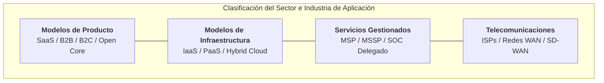

* **Guía de Redacción para la Memoria v1.0:**
  1. Describir la estructura general del sector tecnológico y la vertical de mercado donde se encuadra el proyecto.
  2. Identificar el modelo de prestación de la solución propuesta (suscripción, pago por uso, licenciamiento, contrato de mantenimiento con SLA).
  3. Enumerar empresas u organizaciones de referencia en dicho ámbito (competidores directos o indirectos).

---

### CE.b — Estructura Organizativa y Roles Técnicos

* **Objetivo Curricular:** Caracterizar la empresa u organización tipo indicando la estructura organizativa y las funciones de cada departamento o área técnica.
* **Explicación Profunda:** Las organizaciones tecnológicas se estructuran en equipos multidisciplinares (*Product Squads / Equipos de Operaciones e Ingeniería*) orientados a aportar valor continuo:
  * **Definición de Roles:**
    * *Product Owner (PO) / Product Manager:* Define la visión de la solución, prioriza los requisitos y valida la entrega con el cliente.
    * *Tech Lead / Arquitecto de Software o Sistemas:* Toma decisiones de diseño técnico, selecciona tecnologías y fija estándares de calidad.
    * *Desarrolladores / Ingenieros de Software:* Desarrollan la lógica de negocio, interfaces móviles/web y componentes backend/frontend.
    * *DevOps / SRE (Site Reliability Engineer):* Automatizan pipelines de CI/CD, gestionan infraestructura como código (IaC) y aseguran la disponibilidad de los servicios.
    * *SysAdmin / Ingeniero de Redes y Sistemas:* Configura servidores, hypervisores, electrónica de red, VPNs, enrutamiento y almacenamiento.
    * *SecOps / Ingeniero de Ciberseguridad:* Implementa políticas de bastionado, gestión de identidades, análisis de vulnerabilidades y prevención de intrusiones.
    * *QA Engineer / SDET:* Diseña y ejecuta pruebas automatizadas de integración, rendimiento y seguridad.

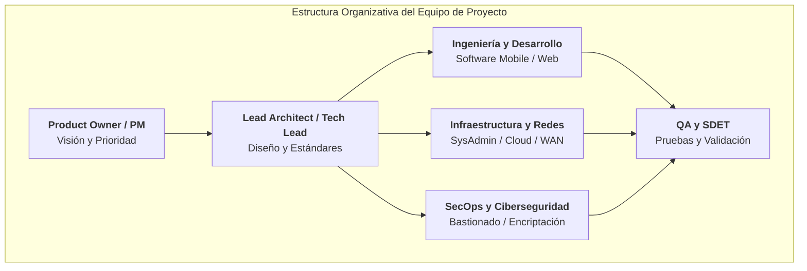

* **Guía de Redacción para la Memoria v1.0:**
  1. Incluir el diagrama del organigrama técnico de la empresa tipo o departamento de TI/Ingeniería.
  2. Describir las funciones y responsabilidades de cada perfil profesional.
  3. Indicar los roles que asume el alumno/a en la ejecución de su proyecto unipersonal.

---

### CE.c — Detección de Necesidades y Dolencias

* **Objetivo Curricular:** Identificar las necesidades más demandadas en el ámbito de actuación del proyecto.
* **Explicación Profunda:** El proyecto debe fundamentarse en la resolución de una problemática o ineficiencia real (*Pain Point*), aplicando metodologías de análisis de causa raíz (*5 Porqués*, *Diagrama de Ishikawa*):
  * **Categoría de Necesidades y Ejemplos:**
    * *Procesos Manuales e Ineficientes:* Ausencia de aplicaciones en movilidad para partes de trabajo en campo, portales web de autogestión lentos o falta de integración entre herramientas.
    * *Problemas de Rendimiento y Escalabilidad:* Servidores incapaces de absorber picos de tráfico, bases de datos no optimizadas o latencias elevadas en conexiones de red.
    * *Vulnerabilidades y Ciberseguridad:* Falta de cifrado en enlaces, ausencia de control de accesos centralizado, falta de bastionado o inexistencia de backups inmutables ante ransomware.
    * *Puntos Únicos de Fallo (SPOF):* Redes o servidores sin redundancia que provocan caídas completas de servicio ante una avería.
    * *Costes Ineficientes:* Ineficiencias en facturación Cloud por falta de políticas FinOps o líneas dedicadas sobredimensionadas.

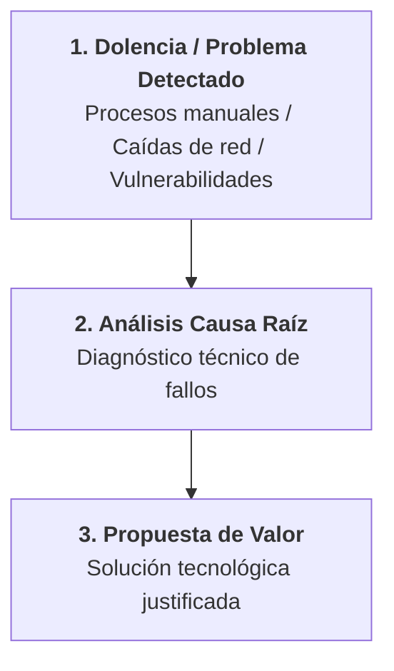

* **Guía de Redacción para la Memoria v1.0:**
  1. Explicar el contexto de la problemática detectada.
  2. Detallar las consecuencias de no resolver el problema (pérdidas económicas, brechas de seguridad, ineficiencia operativa).
  3. Formular la propuesta de valor del proyecto como respuesta directa a la causa raíz.

---

### CE.d — Valoración de Oportunidades y Viabilidad

* **Objetivo Curricular:** Valorar las oportunidades de negocio o mejora previsible en el sector mediante técnicas sistemáticas de análisis.
* **Explicación Profunda:** Demostrar que la solución propuesta es viable evaluando sus tres dimensiones fundamentales:
  1. **Viabilidad Técnica:** Disponibilidad de tecnologías maduras, compatibilidad de entornos y capacidad del equipo para implementar la solución.
  2. **Viabilidad Económica / Financiera:** Justificación de costes de despliegue y operación (CAPEX/OPEX) mediante el retorno de inversión (ROI) o el ahorro generado.
  3. **Viabilidad Operativa:** Sostenibilidad y facilidad de mantenimiento de la infraestructura o software a lo largo del tiempo.

El apartado se completa con la **Matriz DAFO / FODA** (Debilidades, Amenazas, Fortalezas, Oportunidades) y el análisis **PESTEL** (Factores Políticos, Económicos, Sociales, Tecnológicos, Ecológicos y Legales).

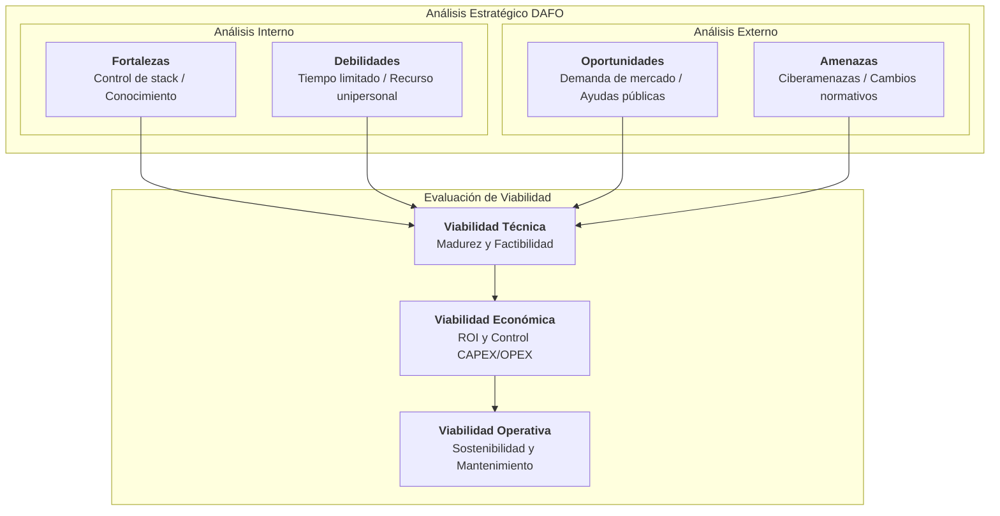

* **Guía de Redacción para la Memoria v1.0:**
  1. Presentar la **Matriz DAFO** rellenando cada cuadrante de forma específica para el proyecto.
  2. Justificar de forma explícita la **Viabilidad Técnica, Económica y Operativa**.
  3. Concluir el análisis estratégico explicando por qué la oportunidad debe ejecutarse.

---

### CE.e — Definición de la Tipología de Proyecto y Alcance

* **Objetivo Curricular:** Identificar el tipo de proyecto requerido para dar respuesta a la necesidad y determinar sus fronteras.
* **Explicación Profunda:** Aplicación del framework **Jobs-To-Be-Done (JTBD)** para acotar la tipología del proyecto y definir la línea base del alcance (*Scope Baseline*):
  * **Tipologías de Ejemplo:**
    * *Aplicación Móvil / Software Multiplataforma:* App nativa o híbrida con sincronización offline y notificaciones.
    * *Plataforma Web SaaS:* Aplicación web responsive con arquitectura de microservicios o API REST.
    * *Infraestructura Cloud / Híbrida:* Despliegue de hipervisores, clústeres de contenedores y servicios de directorio.
    * *Red de Comunicaciones / WAN:* Topología en malla o estrella con enrutamiento seguro y VPNs.
    * *Plataforma de Ciberseguridad / SOC:* Entorno de bastionado, SIEM, firewall y detección de amenazas.
  * **Delimitación de Fronteras:**
    * *In-Scope (En Alcance):* Módulos, servicios, funcionalidades y configuraciones que **SÍ** se implementarán en los Sprints.
    * *Out-of-Scope (Fuera de Alcance):* Elementos que **NO** se incluirán deliberadamente para evitar la dispersión de esfuerzos (*Scope Creep*).

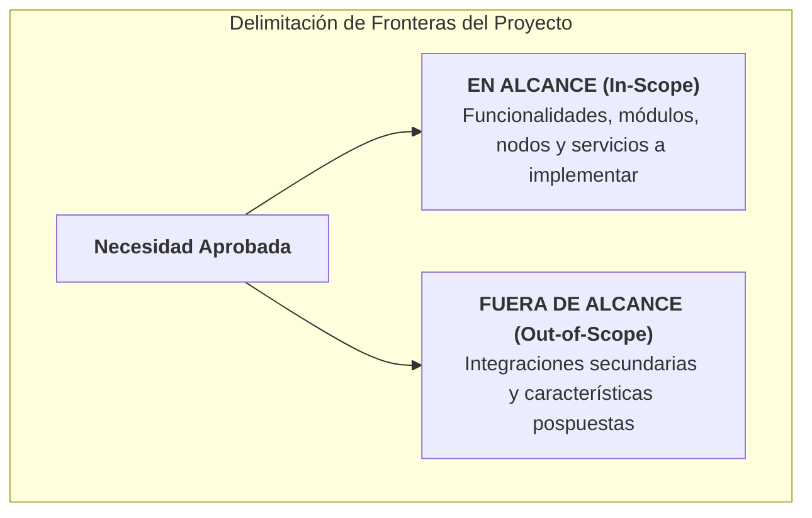

* **Guía de Redacción para la Memoria v1.0:**
  1. Clasificar la tipología del proyecto.
  2. Elaborar la tabla de alcance dividida en dos columnas claras: *En Alcance (In-Scope)* y *Fuera de Alcance (Out-of-Scope)*.

---

### CE.f — Ingeniería de Requisitos y Elección Justificada del Stack

* **Objetivo Curricular:** Determinar las características específicas del proyecto según los requerimientos y seleccionar los medios técnicos.
* **Explicación Profunda:** Clasificación de requisitos bajo la norma internacional **ISO/IEC 25010** de calidad de producto tecnológico:
  * **Requisitos Funcionales (RF):** Capacidades o acciones concretas que debe ejecutar el sistema:
    * *Ejemplo Software:* Autenticación mediante tokens JWT, generación de informes PDF, captura de firma digital.
    * *Ejemplo Redes / Sistemas:* Enrutamiento dinámico BGP, asignación DHCP redundante, replicación de volumen de datos.
    * *Ejemplo Ciberseguridad:* Cifrado TLS 1.3 en comunicaciones, autenticación MFA, bloqueo automático por intentos fallidos.
  * **Requisitos No Funcionales (RNF):** Atributos de calidad y rendimiento:
    * *Ejemplo Rendimiento:* Tiempo de respuesta < 200ms, transferencia de red > 1 Gbps.
    * *Ejemplo Disponibilidad:* Uptime garantizado del 99.9% (SLA), tiempo de recuperación RTO < 1 hora.
    * *Ejemplo Seguridad:* Cumplimiento de políticas de bastionado CIS Benchmarks.
  * **Selección del Stack Tecnológico / Medios:** Elección razonada de lenguajes, frameworks, sistemas operativos, hipervisores, hardware de red o proveedores cloud, justificando el descarte de alternativas.

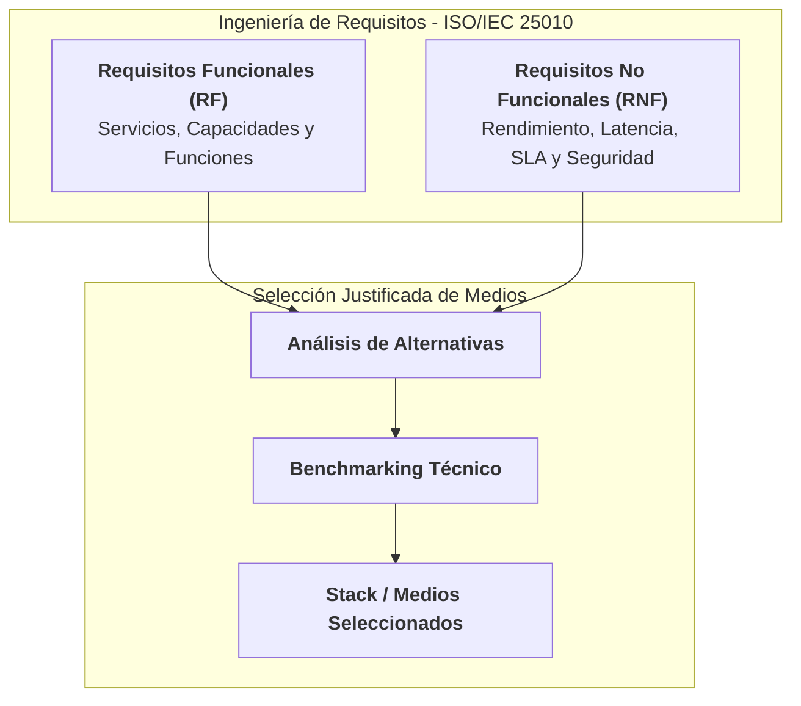

* **Guía de Redacción para la Memoria v1.0:**
  1. Incluir la tabla codificada de Requisitos Funcionales (`RF-01`, `RF-02`...) con prioridad.
  2. Incluir la tabla codificada de Requisitos No Funcionales (`RNF-01`, `RNF-02`...).
  3. Justificar técnicamente el stack tecnológico o hardware seleccionado frente a otras alternativas probadas.

---

### CE.g — Marco Legal, Fiscal, Laboral, PRL y Ciberseguridad

* **Objetivo Curricular:** Determinar las obligaciones fiscales, laborales, de prevención de riesgos y ciberseguridad.
* **Explicación Profunda:** Identificación de la normativa que afecta al desarrollo y operación del proyecto:
  * **Ciberseguridad, Privacidad y Regulación:**
    * *RGPD / LOPD-GDD:* Protección de datos personales, privacidad desde el diseño (*Privacy by Design*) y gestión de consentimientos.
    * *Directiva NIS2 / Esquema Nacional de Seguridad (ENS):* Requisitos de ciberresiliencia, auditorías y gestión de incidentes en infraestructuras.
    * *EU AI Act:* Clasificación de riesgos en proyectos que incorporen componentes de Inteligencia Artificial.
  * **Licenciamiento Software y Hardware:**
    * *Licencias Permisivas:* MIT, Apache 2.0, BSD (permiten uso libre y comercial).
    * *Licencias Copyleft:* GPLv3, AGPL (exigen liberar código derivado en soluciones SaaS/distribuidas).
  * **Fiscalidad, Marco Laboral y PRL:**
    * Formas jurídicas (Autónomo, S.L., ventajas de la *Ley de Startups*).
    * Cumplimiento de la *Ley de Teletrabajo*, registro de jornada y prevención de riesgos laborales (ergonomía PVD - Pantallas de Visualización de Datos).

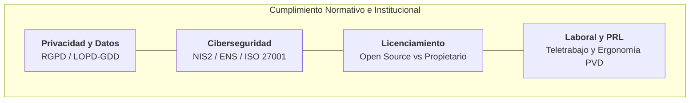

* **Guía de Redacción para la Memoria v1.0:**
  1. Explicar cómo aplica el RGPD a los datos gestionados por la solución.
  2. Enumerar las licencias de software, componentes u otros elementos utilizados.
  3. Indicar el marco fiscal, laboral y las medidas de prevención de riesgos laborales (PRL).

---

### CE.h — Ayudas, Subvenciones e Incentivos a la Innovación

* **Objetivo Curricular:** Identificar posibles ayudas o subvenciones para la incorporación de nuevas tecnologías.
* **Explicación Profunda:** Análisis de vías de financiación pública e incentivos a la innovación aplicables al proyecto:
  * **Programas de Financiación Relevantes:**
    * *Kit Digital (Fondos NextGenerationEU):* Subvenciones para la adopción de herramientas digitales, sitios web, comercio electrónico, gestión de procesos en la nube y ciberseguridad.
    * *Préstamos Participativos ENISA:* Financiación pública para proyectos innovadores sin exigencia de avales personales.
    * *CDTI Neotec:* Ayudas destinadas a empresas de base tecnológica.
    * *Deducciones Fiscales por I+D+i:* Bonificaciones fiscales por desarrollo de software e investigación tecnológica.

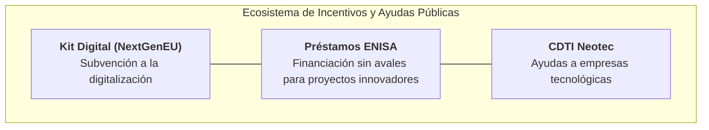

* **Guía de Redacción para la Memoria v1.0:**
  1. Identificar al menos dos programas de subvención o ayuda pública aplicables.
  2. Analizar requisitos de acceso, cuantías asignables y su impacto en la viabilidad económica de la propuesta.

---

### CE.i — Guion de Trabajo, Backlog y Metodología Ágil

* **Objetivo Curricular:** Elaborar el guion de trabajo que se va a seguir para la elaboración del proyecto.
* **Explicación Profunda:** Organización del trabajo por Sprints y configuración de herramientas digitales de gestión:
  * **Estructura de Historias de Usuario / Tarjetas Técnicas:**
    $$\text{Como [Rol / Actor / Sistema]} \longrightarrow \text{Quiero [Acción / Configuración]} \longrightarrow \text{Para [Beneficio / Valor]}$$
  * **Criterios de Aceptación BDD (Behavior-Driven Development):**
    $$\text{Dado [Contexto previo]} \longrightarrow \text{Cuando [Se ejecuta la acción]} \longrightarrow \text{Entonces [Resultado esperado con el criterio de éxito]}$$
  * **Estimación en Story Points (Serie de Fibonacci):** Complejidad relativa ($1, 2, 3, 5, 8, 13$) para medir el esfuerzo de cada tarea.
  * **Tablero Kanban Digital:**
    * Columnas: *Product Backlog $\rightarrow$ Sprint Backlog $\rightarrow$ In Progress $\rightarrow$ In Review / QA $\rightarrow$ Done*.
    * Aplicación de reglas *Definition of Ready (DoR)* (requisitos para iniciar una tarea) y *Definition of Done (DoD)* (requisitos para dar por finalizada una tarea).
    * Límites de trabajo en progreso (*WIP Limits*).

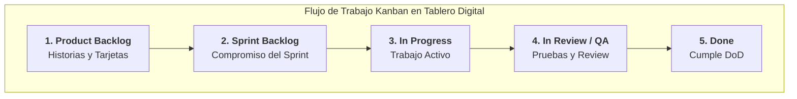

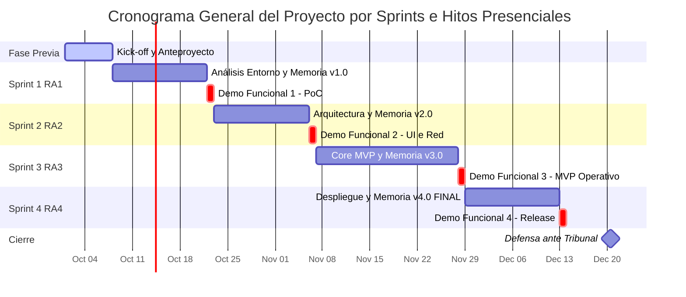

* **Guía de Redacción para la Memoria v1.0:**
  1. Explicar la metodología de Sprints y las reglas DoR y DoD establecidas.
  2. Incluir el enlace público al **Tablero Digital (GitHub Projects, Trello, Jira)**.
  3. Añadir capturas del *Product Backlog* inicial con las Historias de Usuario/Tarjetas Técnicas estimadas en *Story Points*.

---

## 5. Ejecución Práctica de la Prueba de Concepto (PoC) según la Naturaleza del Proyecto

Al finalizar el Sprint 1, además de entregar el documento escrito de la **Memoria v1.0**, el alumno/a debe presentar una **Prueba de Concepto (PoC)** funcionando en vivo. 

La PoC no es el producto final ni una versión completa, sino la demostración técnica de que el entorno de desarrollo o trabajo está correctamente configurado, que los componentes base se comunican y que la arquitectura planteada es ejecutable sin bloqueos críticos antes de iniciar los Sprints de desarrollo e implementación intensiva.

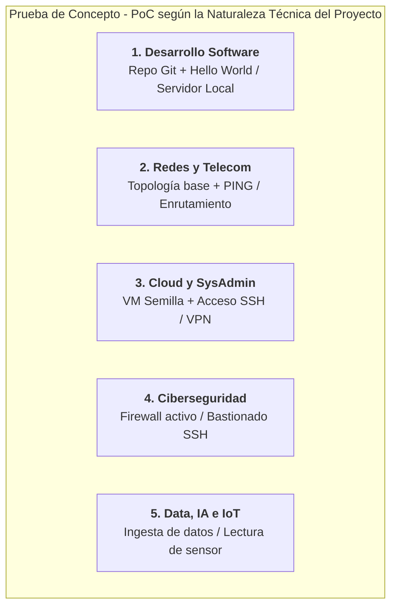

### Detalle de Requisitos de la PoC por Ámbito Técnico:

#### 1. Proyectos de Desarrollo Software (Web, Móvil, Desktop, Microservicios)
* **Objetivo de la PoC:** Comprobar la viabilidad de la compilación, emulación o ejecución del servidor de pruebas en local.
* **Entorno Configurado:** IDE de desarrollo (Android Studio, VS Code, IntelliJ, PyCharm), gestor de paquetes de dependencias (`npm`, `pip`, `maven`, `gradle`), contenedor Docker (si aplica) y repositorio Git local y remoto (`main` / `develop`).
* **Demostración en la Demo Funcional (3 min):**
  * Muestra del código fuente estructurado en el IDE y commit inicial subido al repositorio remoto.
  * Ejecución en vivo de la aplicación generando un *"Hello World"*, una ventana/pantalla base con navegación inicial, o una respuesta HTTP exitosa (código 200 OK) desde un endpoint `/health` o `/api/v1/test`.

#### 2. Proyectos de Redes y Telecomunicaciones (LAN/WAN, SD-WAN, Enlaces Dedicados)
* **Objetivo de la PoC:** Validar el diseño de la topología de red y la conectividad básica IP entre nodos.
* **Entorno Configurado:** Simulador/Emulador de red (Cisco Packet Tracer, GNS3, EVE-NG) o maqueta de hardware físico en laboratorio con interfaces de red etiquetadas.
* **Demostración en la Demo Funcional (3 min):**
  * Presentación del plano de direccionamiento IP y topología física/lógica.
  * Ejecución en vivo de un comando `ping` y `traceroute` entre dos nodos o sedes simuladas comprobando que los paquetes se enmarcan y enrutan correctamente.

#### 3. Proyectos de Cloud, Virtualización y SysAdmin (IaaS, PaaS, On-Premise)
* **Objetivo de la PoC:** Probar la capacidad de provisión de recursos y acceso remoto seguro.
* **Entorno Configurado:** Hipervisor local (Proxmox VE, VMware ESXi, VirtualBox) o cuenta en proveedor Cloud (AWS, Azure, GCP) con VPC y grupos de seguridad configurados.
* **Demostración en la Demo Funcional (3 min):**
  * Verificación de la máquina virtual o contenedor semilla en estado *Running*.
  * Conexión en vivo desde la consola local del alumno/a hacia la VM semilla mediante SSH (o túnel VPN/RDP), mostrando la configuración de red (`ip a` / `ifconfig`) y el uptime del sistema operativo.

#### 4. Proyectos de Ciberseguridad y SOC
* **Objetivo de la PoC:** Demostrar la aplicación de controles perimetrales y políticas de acceso.
* **Entorno Configurado:** Firewall virtualizado (pfSense, OPNsense, iptables/nftables) o entorno de laboratorio de pruebas de penetración / bastionado.
* **Demostración en la Demo Funcional (3 min):**
  * Demostración en vivo de una regla de firewall activa bloqueando tráfico no deseado (ej. bloqueo de ICMP o puerto no autorizado) y permitiendo tráfico legítimo.
  * Muestra del bastionado inicial del servicio de administración (cambio de puerto SSH por defecto, autenticación exclusiva por clave pública/privada y registros de log activos).

#### 5. Proyectos de Data, Inteligencia Artificial e IoT
* **Objetivo de la PoC:** Validar el canal de ingesta de datos o la lectura desde la fuente de origen.
* **Entorno Configurado:** Placa/Dispositivo físico (Raspberry Pi, ESP32, Arduino) con sensor conectado, o entorno de desarrollo Python/Jupyter Notebook con bibliotecas de análisis cargadas.
* **Demostración en la Demo Funcional (3 min):**
  * Ejecución en vivo del script de captura mostrando la lectura de datos del sensor por puerto serie/MQTT o la carga y limpieza inicial de un archivo de datos (CSV/JSON/Database) en consola.

---

## 6. Matriz de Entregables en Moodle y Demo Funcional Presencial

Para completar con éxito el Sprint 1, el alumno/a debe subir a Moodle los siguientes tres elementos:

| # | Elemento Entregable | Formato / Enlace | Descripción |
| :-: | :--- | :--- | :--- |
| **1** | **Memoria Incremental v1.0** | Archivo `.pdf` | Capítulo 1 redactado respondiendo íntegramente a los 9 Criterios de Evaluación (CE.a al CE.i). |
| **2** | **Tablero Digital de Tareas** | URL Pública | Enlace a GitHub Projects, Trello o Jira con las Historias de Usuario estimadas del proyecto. |
| **3** | **Repositorio / Artefacto Técnico** | URL Pública / Evidencia | Enlace a GitHub / GitLab / Diagrama de red / Entorno de pruebas con el commit o estado inicial de la PoC. |

> 🎙️ **Hito Presencial Obligatorio (Demo Funcional 1):** Presentación individual in situ de 3 minutos ante el profesor demostrando en vivo el funcionamiento de la *PoC* para obtener la calificación de **Apto** en el Sprint 1.

---

## 7. Checklist de Autoevaluación para el Alumnado

Antes de realizar la entrega en Moodle, verifica que cumples con todos los puntos:

- [ ] He asistido a la **Reunión Previa de Orientación** con el profesor/a.
- [ ] He subido el **Anteproyecto (Kick-off)** a Moodle aceptando el acuerdo pedagógico y declarando mi autoría.
- [ ] La **Memoria v1.0** incluye las 9 secciones asociadas a los criterios **CE.a al CE.i**.
- [ ] El **CE.d** incluye la Matriz DAFO y la evaluación de Viabilidad Técnica, Económica y Operativa.
- [ ] He redactado el análisis de obligaciones legales, licencias y ciberseguridad (**CE.g**).
- [ ] Mi **Tablero Digital (Kanban)** está configurado con las Historias de Usuario/Tarjetas Técnicas estimadas.
- [ ] El **Repositorio / Entorno Técnico** tiene el estado inicial de la Prueba de Concepto (*PoC*).
- [ ] Mi **Prueba de Concepto (PoC)** ejecuta o demuestra su funcionamiento en vivo para la Demo Funcional.
