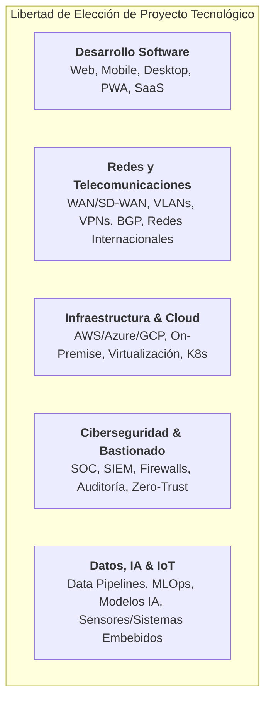
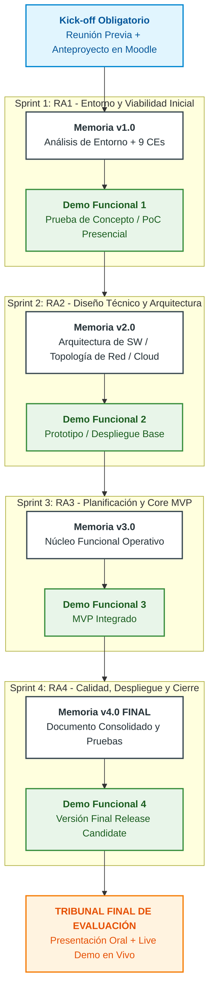
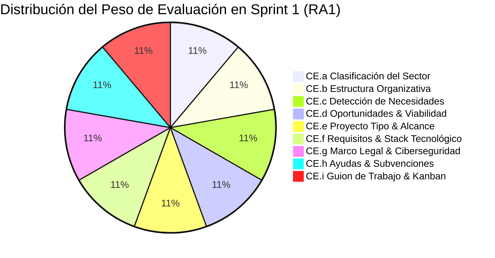
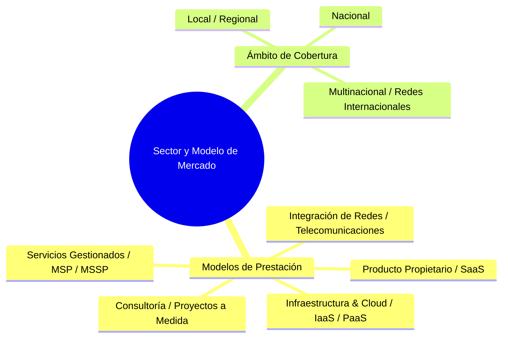
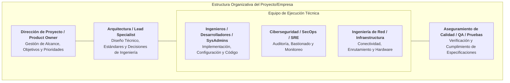
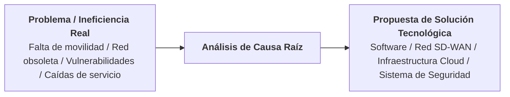
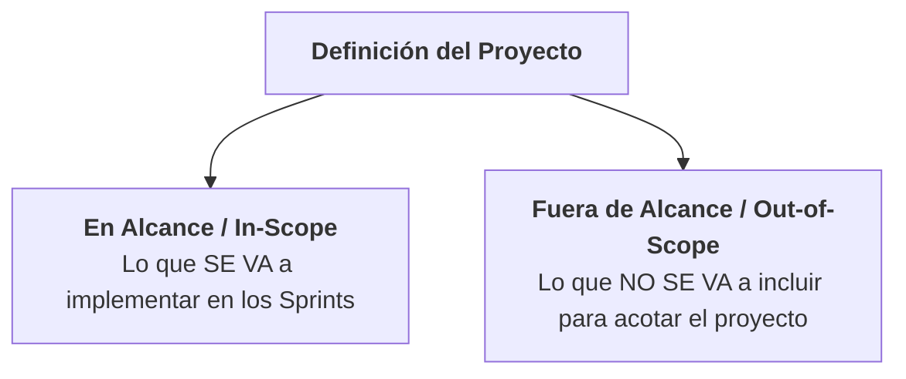
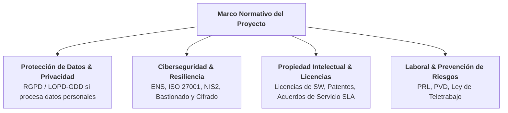
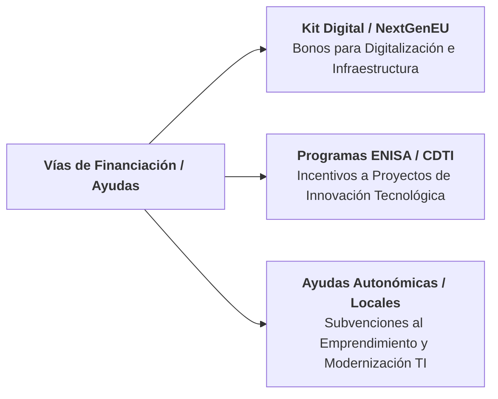
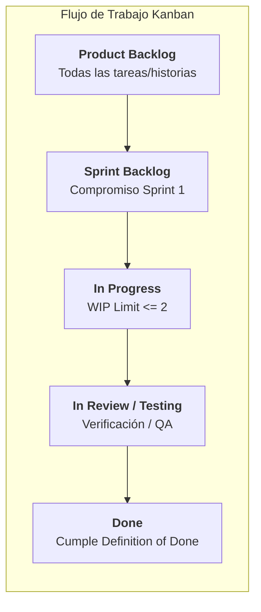

# 🚀 Guía Metodológica Universal: RA1 — Estudio del Entorno Productivo y Demandas del Mercado

> **Módulo Profesional:** Proyecto Intermodular / Proyecto Integrado  
> **Ámbito:** Cualquier Tipología de Proyecto Tecnológico (Desarrollo Software Web/Móvil/Desktop, Infraestructura Cloud/On-Premise, Redes Nacionales e Internacionales, Ciberseguridad, Data/IA, IoT o Sistemas Embebidos)  
> **Fase del Proyecto:** Kick-off & Sprint 1 | **Entregable:** Memoria Incremental v1.0  
> **Rol del Alumnado:** *Lead Engineer / Technical Project Lead / DevOps / Architect* (Único Responsable de Proyecto)  
> **Rol del Docente:** *Guía Metodológico, Orientador Técnico y Evaluador / Tribunal*

---

## 📋 Índice
1. [Enfoque Agnosticista y Universal del Proyecto](#1-enfoque-agnosticista-y-universal-del-proyecto)
2. [Ciclo de Vida Incremental del Proyecto](#2-ciclo-de-vida-incremental-del-proyecto)
3. [Prerrequisito Obligatorio: Kick-off y Anteproyecto](#3-prerrequisito-obligatorio-kick-off-y-anteproyecto)
4. [Desglose Universal Criterio por Criterio (CE.a al CE.i)](#4-desglose-universal-criterio-por-criterio-cea-al-cei)
   - [CE.a — Clasificación del Sector y Entorno de Aplicación](#ce-a--clasificación-del-sector-y-entorno-de-aplicación)
   - [CE.b — Estructura Organizativa y Roles Técnicos](#ce-b--estructura-organizativa-y-roles-técnicos)
   - [CE.c — Detección Universal de Necesidades y Dolencias](#ce-c--detección-universal-de-necesidades-y-dolencias)
   - [CE.d — Valoración de Oportunidades y Viabilidad](#ce-d--valoración-de-oportunidades-y-viabilidad)
   - [CE.e — Definición de la Tipología de Proyecto y Alcance](#ce-e--definición-de-la-tipología-de-proyecto-y-alcance)
   - [CE.f — Ingeniería de Requisitos y Elección Justificada del Stack](#ce-f--ingeniería-de-requisitos-y-elección-justificada-del-stack)
   - [CE.g — Marco Legal, Regulatorio, Ciberseguridad y PRL](#ce-g--marco-legal-regulatorio-ciberseguridad-y-prl)
   - [CE.h — Ayudas, Subvenciones y Viabilidad Económica](#ce-h--ayudas-subvenciones-y-viabilidad-económica)
   - [CE.i — Planificación Metodológica, Gestión de Tareas y Kanban](#ce-i--planificación-metodológica-gestión-de-tareas-y-kanban)
5. [Adaptación de la Prueba de Concepto (PoC) según la Naturaleza del Proyecto](#5-adaptación-de-la-prueba-de-concepto-poc-según-la-naturaleza-del-proyecto)
6. [Matriz de Entregables en Moodle y Demo Funcional Presencial](#6-matriz-de-entregables-en-moodle-y-demo-funcional-presencial)
7. [Checklist de Autoevaluación para el Alumnado](#7-checklist-de-autoevaluación-para-el-alumnado)

---

## 1. Enfoque Agnosticista y Universal del Proyecto

El módulo de Proyecto **no está acoplado a una tecnología o tipología concreta**. Cada alumno tiene plena libertad para proponer y desarrollar cualquier solución tecnológica válida, incluyendo pero no limitándose a:



La **metodología de análisis, viabilidad, requisitos y planificación (RA1)** es exactamente la misma independientemente de la naturaleza técnica de la solución.

---

## 2. Ciclo de Vida Incremental del Proyecto

El proyecto se desarrolla de forma **incremental por Sprints**. El alumno/a mantendrá un **único documento maestro (la Memoria del Proyecto)** que evolucionará desde la versión `v1.0` hasta la `v4.0 FINAL`.



---

## 3. Prerrequisito Obligatorio: Kick-off y Anteproyecto

Antes de comenzar a redactar el Sprint 1 o desarrollar código/configuraciones, el alumno/a debe cumplir con la fase previa de **Kick-off**:

1. **Iniciativa de la Reunión Previa:** Es responsabilidad del alumno/a solicitar y agendar una reunión individual con el profesor/a para exponer verbalmente la idea, alcance preliminar y recursos. El docente actúa como orientador y guía.
2. **Redacción y Subida del Anteproyecto:** Elaborar el documento inicial con los apartados obligatorios (*Título, Descripción/Objetivos, Método/Fases, Medios/Recursos, Bibliografía y Declaración de Autoría*).
3. **Validación en Moodle:** La subida del Anteproyecto constituye la aceptación incondicional del acuerdo pedagógico y la declaración explícita de autoría redactada por el alumno.

> ⚠️ **Requisito Innegociable:** La subida e incorporación del Anteproyecto a Moodle en tiempo y forma es condición indispensable. **Sin el Anteproyecto aprobado, el alumno/a no podrá realizar las Demos Funcionales ni optar a la Defensa Final ante el Tribunal de Profesores.**

---

## 4. Desglose Universal Criterio por Criterio (CE.a al CE.i)

Cada uno de los 9 Criterios de Evaluación del RA1 pondera exactamente un **11.11% de la nota del Sprint 1**.



---

### CE.a — Clasificación del Sector y Entorno de Aplicación

* **Objetivo:** Clasificar las empresas y organizaciones del sector de aplicación por sus características organizativas y los productos o servicios que ofrecen.
* **Enfoque Universal:** El alumno debe analizar la industria o ámbito donde se enmarca su solución (tecnológica, industrial, logística, sanitaria, financiera, telecomunicaciones, etc.) y categorizar los actores que prestan servicios similares.



* **Guía para la Memoria v1.0 (Sección 1.1):**
  * Describir la taxonomía del sector donde operará la solución.
  * Analizar modelos de negocio imperantes (Suscripción, Pago por Uso/Recursos, Licenciamiento, Llave en mano, Contratos de Mantenimiento / SLA).

---

### CE.b — Estructura Organizativa y Roles Técnicos

* **Objetivo:** Caracterizar la empresa u organización tipo indicando la estructura organizativa y las funciones de cada departamento o área técnica.
* **Enfoque Universal:** Describir la estructura organizativa necesaria para sostener una solución como la propuesta, detallando las responsabilidades de cada rol independientemente de la especialidad.



* **Guía para la Memoria v1.0 (Sección 1.2):**
  * Dibujar el organigrama tipo de la empresa o departamento de TI/Ingeniería.
  * Definir las competencias técnicas y operativas de cada perfil.

---

### CE.c — Detección Universal de Necesidades y Dolencias

* **Objetivo:** Identificar las necesidades más demandadas en el ámbito de actuación del proyecto.
* **Enfoque Universal:** Identificar la problemática, ineficiencia o cuello de botella real (*Pain Point*) que motiva la existencia del proyecto.



* **Ejemplos de Necesidades según la Naturaleza del Proyecto:**
  * **Desarrollo Software:** Inexistencia de herramienta para automatizar un proceso manual, problemas de sincronización de datos o mala experiencia de usuario.
  * **Infraestructura & Redes:** Saturación de ancho de banda, falta de redundancia en enlaces internacionales, caídas de servicio por punto único de fallo (*SPOF*).
  * **Ciberseguridad:** Inexistencia de control de accesos, exposición a ciberataques, falta de encriptación en enlaces de comunicación.
  * **Data & IA:** Imposibilidad de procesar grandes volúmenes de datos en tiempo real o necesidad de modelos predictivos.

---

### CE.d — Valoración de Oportunidades y Viabilidad

* **Objetivo:** Valorar las oportunidades de negocio o mejora previsible en el sector mediante técnicas sistemáticas de análisis.
* **Enfoque Universal:** Aplicar herramientas estandarizadas de análisis estratégico y evaluación de viabilidad.

```mermaid
quadrantChart
    title Matriz de Análisis de Viabilidad y Oportunidad
    x-axis Dificultad de Implementación Baja --> Dificultad de Implementación Alta
    y-axis Valor e Impacto Bajo --> Valor e Impacto Alto
    quadrant-1 Prioridad Estratégica (Alto Valor / Complejo)
    quadrant-2 Victoria Rápida / Quick Win (Alto Valor / Viable)
    quadrant-3 Descartar / Despriorizar
    quadrant-4 Evaluación Secundaria
    "Solución Propuesta": [0.38, 0.85]
    "Alternativa Tradicional": [0.15, 0.25]
    "Desarrollo Sobredimensionado": [0.85, 0.40]
```

* **Guía para la Memoria v1.0 (Sección 1.4):**
  * Elaborar la **Matriz DAFO / FODA** (Debilidades, Amenazas, Fortalezas, Oportunidades).
  * Evaluar la viabilidad en tres dimensiones: **Técnica** (¿es realizable?), **Económica** (¿es sostenible?) y **Operativa** (¿es mantenible?).

---

### CE.e — Definición de la Tipología de Proyecto y Alcance

* **Objetivo:** Identificar el tipo de proyecto requerido para dar respuesta a la necesidad y determinar sus fronteras.
* **Enfoque Universal:** Delimitar con precisión el objeto del proyecto y definir explícitamente qué está dentro del alcance (*In-Scope*) y qué queda fuera (*Out-of-Scope*).



* **Guía para la Memoria v1.0 (Sección 1.5):**
  * Describir la solución elegida (ej. *Plataforma Web SaaS*, *Interconexión SD-WAN mediante VPNs IPSec*, *Clúster de Alta Disponibilidad*, *Sistema de Detección de Intrusos*, etc.).
  * Enumerar de forma clara los límites del proyecto para garantizar su viabilidad en el tiempo lectivo disponible.

---

### CE.f — Ingeniería de Requisitos y Elección Justificada del Stack

* **Objetivo:** Determinar las características específicas del proyecto según los requerimientos y seleccionar los medios técnicos.
* **Enfoque Universal:** Definición rigurosa de Requisitos Funcionales y No Funcionales bajo el estándar **ISO/IEC 25010** y justificación técnica de los componentes elegidos.

```mermaid
graph TD
    subgraph Especificacion_Tecnica [Especificación de Requisitos y Medios]
        RF[<b>Requisitos Funcionales (RF)</b><br/>¿Qué debe HACER el sistema/red?]
        RNF[<b>Requisitos No Funcionales (RNF)</b><br/>Latencia, Disponibilidad, Ancho de Banda, Seguridad, Escalabilidad]
        
        subgraph Stack_y_Recursos [Stack Tecnológico / Medios Elegidos]
            HW[<b>Hardware / Comunicaciones</b><br/>Servidores, Routers, Switches, Cableado, Equipos]
            SW[<b>Software / Sistema Operativo</b><br/>OS, Frameworks, DB, Controladores, Protocolos]
            CLOUD[<b>Servicios / Cloud / Enlaces</b><br/>Proveedores, Cloud, VPNs, Ancho de Banda]
        end
    end

    RF --> Stack_y_Recursos
    RNF --> Stack_y_Recursos
```

* **Guía para la Memoria v1.0 (Sección 1.6):**
  * Redactar la tabla numerada de **Requisitos Funcionales (RF-01, RF-02...)**.
  * Redactar la tabla de **Requisitos No Funcionales (RNF-01, RNF-02...)**: Tiempos de respuesta, disponibilidad (% uptime), ancho de banda mínimo, cifrado, tolerancia a fallos, etc.
  * Justificar técnicamente la elección de las tecnologías, herramientas, protocolos o hardware seleccionados.

---

### CE.g — Marco Legal, Regulatorio, Ciberseguridad y PRL

* **Objetivo:** Determinar las obligaciones fiscales, laborales, de prevención de riesgos, ciberseguridad y normativas de aplicación.
* **Enfoque Universal:** Identificar el marco normativo específico que aplica al proyecto según su naturaleza.



* **Guía para la Memoria v1.0 (Sección 1.7):**
  * **Protección de Datos:** Análisis de cumplimiento del RGPD (*Privacy by Design*, cifrado en tránsito y reposo).
  * **Ciberseguridad:** Medidas de seguridad aplicables (Politica de contraseñas, bastionado, firewalls, gestión de parches).
  * **Licenciamiento y Propiedad:** Licencias del software/hardware utilizado (Open Source, Propietario, Comercial) y propiedad del producto final.
  * **Fiscal, Laboral y PRL:** Forma jurídica (Autónomo, S.L., Startup), obligaciones tributarias básicas y prevención de riesgos laborales (PVD/Ergonomía).

---

### CE.h — Ayudas, Subvenciones y Viabilidad Económica

* **Objetivo:** Identificar posibles ayudas, subvenciones o programas de incentivo para la puesta en marcha de la solución.
* **Enfoque Universal:** Investigar líneas de financiación e incentivos públicos o privados aplicables a la innovación tecnológica, digitalización o despliegue de infraestructuras.



* **Guía para la Memoria v1.0 (Sección 1.8):**
  * Seleccionar e investigar al menos **2 programas oficiales de ayuda o subvención**.
  * Detallar requisitos de acceso, cuantías financiables y aplicabilidad directa al proyecto.

---

### CE.i — Planificación Metodológica, Gestión de Tareas y Kanban

* **Objetivo:** Elaborar el guion de trabajo y la planificación metodológica que se va a seguir para el desarrollo del proyecto.
* **Enfoque Universal:** Estructuración del trabajo mediante **Metodología Ágil (Kanban)** en un tablero digital (GitHub Projects, Trello, Jira) dividiendo el proyecto en unidades de trabajo estimadas.



#### Estructura Universal de una Tarea / Historia de Usuario
Independientemente de la tecnología, cada tarjeta del tablero debe incluir:

* **Sintaxis de Requisito / Historia:**  
  * *En desarrollo software:* `"Como [Rol], quiero [Función] para [Beneficio]"`  
  * *En infraestructura/redes:* `"Como [SysAdmin/NetEng], necesito [Configuración/Despliegue] para garantizar [Disponibilidad/Seguridad]"`
* **Criterios de Aceptación (Formato Given-When-Then / Dado-Cuando-Entonces):**  
  * `Dado` [Un estado inicial o entorno preconfigurado]  
  * `Cuando` [Se ejecuta una acción, petición o tráfico de red]  
  * `Entonces` [Se obtiene el resultado esperado, respuesta o comportamiento verificado]
* **Estimación en Story Points (Serie de Fibonacci: 1, 2, 3, 5, 8, 13):** Complejidad relativa basada en esfuerzo, riesgo e incertidumbre.

---

## 5. Adaptación de la Prueba de Concepto (PoC) según la Naturaleza del Proyecto

Al finalizar el Sprint 1, además de la entrega escrita de la Memoria v1.0, el alumno debe presentar una **Prueba de Concepto (PoC) técnica funcionando en vivo** durante la Demo Funcional. La PoC se adapta completamente a lo que cada alumno esté desarrollando:

```mermaid
graph TD
    subgraph PoC_Agnostica [Ejemplos de Prueba de Concepto según el Proyecto]
        A[<b>Proyecto Software (Web/App/Desktop)</b><br/>Estructura base del proyecto, repositorio Git configurado y 'Hello World' ejecutándose en entorno local o servidor]
        B[<b>Proyecto de Redes / Telecomunicaciones</b><br/>Topología simulada/física inicial con enrutamiento básico funcional y prueba de conectividad PING/Traceroute exitosa entre nodos]
        C[<b>Proyecto de Infraestructura / Cloud</b><br/>Instancia/Máquina Semilla aprovisionada, interfaz de red configurada y acceso remoto seguro SSH/RDP verificado]
        D[<b>Proyecto de Ciberseguridad / SOC</b><br/>Entorno de pruebas levantado, agente/sensor instalado y captura básica de eventos/logs funcionando]
        E[<b>Proyecto de Data / IA / IoT</b><br/>Script de ingesta de datos base o lectura de sensor físico/simulado emitiendo métricas correctamente]
    end
```

---

## 6. Matriz de Entregables en Moodle y Demo Funcional Presencial

Para superar el Sprint 1, el alumno/a debe entregar en Moodle tres elementos:

| # | Elemento Entregable | Formato / Canal | Descripción Obligatoria |
| :-: | :--- | :--- | :--- |
| **1** | **Memoria Incremental v1.0** | Archivo `.pdf` | Capítulo 1 redactado cubriendo los 9 Criterios de Evaluación (**CE.a al CE.i**). |
| **2** | **Tablero Digital de Gestión** | URL Pública | Enlace al tablero Kanban (GitHub Projects, Trello, Jira) con las tareas estimadas en Story Points. |
| **3** | **Repositorio de Código / Configuración** | URL Pública | Enlace al repositorio Git (GitHub/GitLab) con el commit inicial de la Prueba de Concepto (*PoC*). |

> 🎙️ **Hito Presencial Obligatorio (Demo Funcional 1):** Exposición individual presencial de 3 minutos ante el profesor mostrando en vivo el funcionamiento de la Prueba de Concepto (*PoC*) para obtener la calificación de **Apto** en el Sprint 1.

---

## 7. Checklist de Autoevaluación para el Alumnado

Antes de realizar la entrega definitiva en Moodle, verifica que cumples los siguientes puntos:

- [ ] He solicitado y mantenido la **Reunión Previa de Orientación** con el profesor/a.
- [ ] He subido el **Anteproyecto (Kick-off)** a Moodle aceptando el acuerdo pedagógico y declarando la autoría redactada por mí mismo/a.
- [ ] La **Memoria v1.0 (PDF)** contiene los 9 apartados asociados a los criterios **CE.a al CE.i**.
- [ ] He definido los **Requisitos Funcionales y No Funcionales** específicos de mi solución.
- [ ] He incluido el análisis del marco legal (**RGPD, Ciberseguridad, Licencias, PRL**).
- [ ] Mi **Tablero Digital (Kanban)** tiene las tareas descritas con criterios de aceptación y estimadas en Story Points.
- [ ] El **Repositorio Git** contiene la estructura base y la Prueba de Concepto (*PoC*).
- [ ] La **Prueba de Concepto (PoC)** está preparada para ser mostrada en vivo durante la Demo Funcional presencial.
