# 🚀 Guía Metodológica: RA2 — Propuesta, Diseño y Análisis de Arquitectura del Proyecto

> **Módulo Profesional:** Proyecto Intermodular / Proyecto Integrado (DAM / DAW / ASIR)  
> **Ámbito:** Cualquier Tipología de Proyecto Tecnológico (Desarrollo Software Web/Móvil/Desktop, Infraestructura Cloud/On-Premise, Redes Nacionales e Internacionales, Ciberseguridad/SOC, Data/IA, IoT o Sistemas Embebidos)  
> **Fase del Proyecto:** Sprint 2 | **Entregable:** Memoria Incremental v2.0 (Capítulo 1 Consolidado + Capítulo 2: Propuesta, Diseño y Arquitectura)  
> **Rol del Alumno/a:** *Architect / Technical Lead / Lead Developer / DevOps / SecOps / SysAdmin* (Responsable Único del Proyecto)  
> **Rol del Docente:** *Guía Metodológico, Orientador Técnico y Evaluador / Tribunal*

---

## 📋 Índice
1. [Enfoque del Proyecto](#1-enfoque-del-proyecto)
2. [Ciclo de Vida Incremental del Proyecto (Fase RA2)](#2-ciclo-de-vida-incremental-del-proyecto-fase-ra2)
3. [Prerrequisito Obligatorio: Consolidación del Sprint 1](#3-prerrequisito-obligatorio-consolidación-del-sprint-1)
4. [Desglose Criterio por Criterio (CE.a al CE.i)](#4-desglose-criterio-por-criterio-cea-al-cei)
   - [CE.a — Recopilación e Investigación de Información Técnica del Proyecto](#ce-a--recopilación-e-investigación-de-información-técnica-del-proyecto)
   - [CE.b — Estudio Detallado de Viabilidad Técnica y Análisis de Riesgos](#ce-b--estudio-detallado-de-viabilidad-técnica-y-análisis-de-riesgos)
   - [CE.c — Identificación de Fases, Cronograma y Plazos de Ejecución](#ce-c--identificación-de-fases-cronograma-y-plazos-de-ejecución)
   - [CE.d — Definición de Objetivos (SMART), Alcance y Métricas de Éxito](#ce-d--definición-de-objetivos-smart-alcance-y-métricas-de-éxito)
   - [CE.e — Desglose de Actividades, EDT/WBS y Planificación de Tareas](#ce-e--desglose-de-actividades-edtwbs-y-planificación-de-tareas)
   - [CE.f — Determinación y Estimación de Recursos Materiales y Personales](#ce-f--determinación-y-estimación-de-recursos-materiales-y-personales)
   - [CE.g — Presupuesto, Análisis de Costes (CAPEX/OPEX) y Necesidades de Financiación](#ce-g--presupuesto-análisis-de-costes-capexopex-y-necesidades-de-financiación)
   - [CE.h — Diseño de Arquitectura, Diagramas Técnicos y Documentación del Proyecto](#ce-h--diseño-de-arquitectura-diagramas-técnicos-y-documentación-del-proyecto)
   - [CE.i — Plan de Control de Calidad, Pruebas y Gestión de Incidencias](#ce-i--plan-de-control-de-calidad-pruebas-y-gestión-de-incidencias)
5. [Ejecución Práctica de la Arquitectura y Prototipado (Demo Funcional 2)](#5-ejecución-práctica-de-la-arquitectura-y-prototipado-demo-funcional-2)
6. [Matriz de Entregables en Moodle y Demo Funcional Presencial (Sprint 2)](#6-matriz-de-entregables-en-moodle-y-demo-funcional-presencial-sprint-2)
7. [Checklist de Autoevaluación para el Alumnado (Sprint 2)](#7-checklist-de-autoevaluación-para-el-alumnado-sprint-2)

---

## 1. Enfoque del Proyecto (Sprint 2 — Arquitectura y Diseño)

En esta segunda fase del proyecto, el alumno/a da el salto desde el estudio del entorno y viabilidad inicial (Sprint 1 / RA1) hacia el **diseño formal de la solución tecnológica y su arquitectura completa**.

Cualquiera que sea la especialidad del estudiante, el Sprint 2 requiere transformar la idea aprobada en una especificación técnica rigurosa, planos/diagramas estandarizados, descomposición de trabajo y presupuestación profesional:

### 📱 Desarrollo de Software Multiplataforma (DAM)
* **Arquitectura de Aplicación:** Diseño de patrones de arquitectura (MVVM, Clean Architecture).
* **Modelado de Datos:** Definición de esquemas de datos para almacenamiento local y remoto.
* **Diagramación Técnica:** Elaboración de diagramas UML de clases y de secuencia.
* **Prototipado UI/UX:** Diseño de wireframes y prototipos interactivos de interfaz de usuario.
* **Contratos de Integración:** Especificación de interfaces y contratos de comunicación.

### 🌐 Desarrollo de Aplicaciones Web (DAW)
* **Arquitectura Web:** Diseño de arquitecturas Full-Stack, Serverless y Microservicios.
* **Modelado de Datos:** Diseño de modelos de datos relacionales (ER) o no relacionales (NoSQL).
* **Especificación de APIs:** Definición de contratos API REST, GraphQL o gRPC (OpenAPI / Swagger).
* **Diseño de Interfaces:** Prototipado PWA e interfaces web dinámicas.
* **Servicios Cloud:** Integración y arquitectura de servicios en la nube.

### 🖥️ Administración de Sistemas Informáticos y Redes (ASIR)
* **Topologías de Red:** Diseño de redes L2/L3 y mapas de direccionamiento IP.
* **Arquitectura Cloud e IaC:** Diagramas de infraestructura y aprovisionamiento con Infraestructura como Código (Terraform, Ansible).
* **Seguridad y Bastionado:** Políticas de acceso Zero-Trust y bastionado de sistemas.
* **Planes de Capacidad:** Estimación de recursos de almacenamiento, cómputo y red.
* **Alta Disponibilidad:** Diseño de esquemas de redundancia y tolerancia a fallos.

---

## 2. Ciclo de Vida Incremental del Proyecto (Fase RA2)

El documento del estudiante evoluciona a la **Memoria v2.0**, integrando el Capítulo 1 corregido e incorporando íntegramente el **Capítulo 2 (Propuesta y Análisis del Proyecto)**.

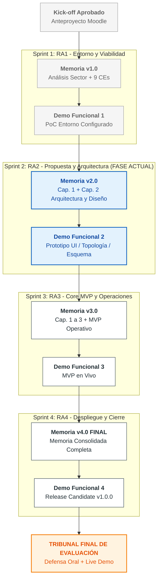

---

## 3. Prerrequisito Obligatorio: Consolidación del Sprint 1

Antes de comenzar la redacción del Capítulo 2 (RA2), el alumno/a debe haber satisfecho las observaciones y correcciones indicadas por el docente en la revisión del Sprint 1:

1. **Revisión del Feedback de la Memoria v1.0:** Incorporar las correcciones o ampliaciones solicitadas en el Capítulo 1 (entorno, DAFO, viabilidad, requisitos e historias de usuario iniciales).
2. **Consolidación del Repositorio Git:** Mantener la estructura del proyecto en Git organizando la documentación en una carpeta dedicada (ej. `/docs/memoria_v2.0.pdf` o `/docs/arquitectura/`).
3. **Aprobación de la PoC Inicial:** Haber superado la Demo Funcional 1 (PoC) para garantizar que los cimientos técnicos están operativos antes de abordar el diseño detallado.

---

## 4. Desglose Criterio por Criterio (CE.a al CE.i)

Cada uno de los 9 Criterios de Evaluación del RA2 pondera exactamente un **11.11% de la nota del Sprint 2**.

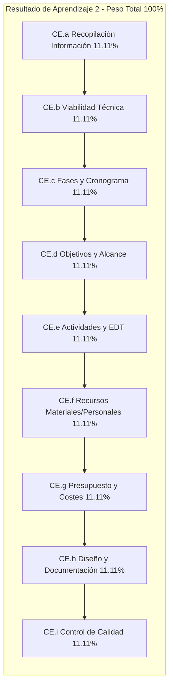

---

### CE.a — Recopilación e Investigación de Información Técnica del Proyecto

* **Objetivo Curricular:** Se ha recopilado información relativa a los aspectos que van a ser tratados en el proyecto.
* **Explicación Profunda:** El alumno/a debe realizar un levantamiento exhaustivo de información técnica, normativa y de mercado que fundamente las decisiones de diseño de su proyecto. Se investigan proyectos similares (*Benchmarking*), documentación oficial de fabricantes/frameworks, normativas técnicas aplicables y estándares de la industria.
  * **Fuentes Documentales e Investigación:**
    * Documentación técnica oficial de lenguajes, librerías, hipervisores o servicios cloud.
    * Análisis comparativo de soluciones existentes en el mercado (*Benchmarking* competitivo).
    * Búsqueda de estándares de diseño (IEEE, ISO, RFCs de red, OWASP, CIS Benchmarks).

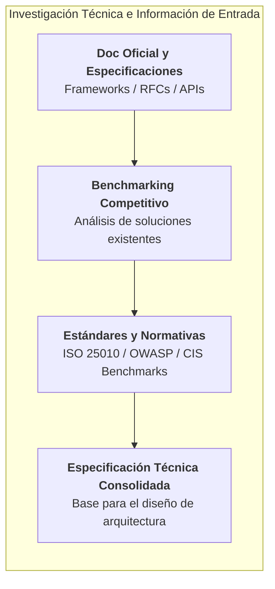

* **Ejemplos por Ciclo Formativo:**
  * **DAM:** Investigación de guías de diseño de interfaz de Apple (Human Interface Guidelines) y Material Design 3 de Google, análisis de librerías de persistencia local (Room, Realm, SQLite) y benchmarking de apps de la competencia.
  * **DAW:** Investigación de arquitecturas de renderizado (SSR vs. SSG vs. Client-side), estándares REST/OpenAPI 3.0, patrones de diseño de microservicios y benchmarking de plataformas SaaS similares.
  * **ASIR:** Investigación de guías de bastionado CIS Benchmarks para Linux/Windows, estándares de cableado estructurado e interconexión de redes, documentación oficial de proveedores Cloud (AWS Well-Architected Framework) y comparativa de licencias de hipervisores (Proxmox vs. VMware).

---

### CE.b — Estudio Detallado de Viabilidad Técnica y Análisis de Riesgos

* **Objetivo Curricular:** Se ha realizado el estudio de viabilidad técnica del proyecto.
* **Explicación Profunda:** Profundización en el estudio de factibilidad técnica iniciado en el Sprint 1, evaluando la capacidad real de implementar la solución diseñada dentro de los límites de tiempo, hardware, licencias y conocimientos disponibles, incluyendo una **Matriz de Gestión de Riesgos Técnicos**.
  * **Dimensiones del Estudio:**
    * *Compatibilidad e Interoperabilidad:* Garantía de que los componentes elegidos se integran sin conflictos.
    * *Límites de Rendimiento y Escalabilidad:* Evaluación de la capacidad del stack para soportar la carga prevista.
    * *Análisis de Riesgos Técnicos:* Identificación de posibles cuellos de botella, obsolescencia o dependencias críticas.

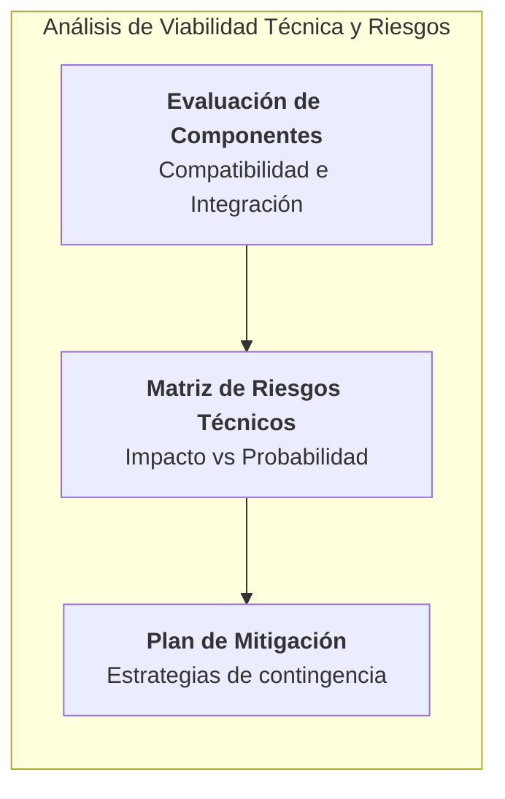

* **Ejemplos por Ciclo Formativo:**
  * **DAM:** Análisis de compatibilidad entre versiones de Android/iOS, evaluación de consumo de batería y memoria RAM al usar IA en dispositivo (*On-device AI*), y plan de mitigación ante cambios en las APIs de tiendas oficiales (Google Play / App Store).
  * **DAW:** Evaluación de latencia en llamadas a APIs de terceros (ej. pasarelas de pago o LLMs), análisis de costes de escalado automático en Serverless y plan de mitigación ante caídas de proveedores de hosting/CDN.
  * **ASIR:** Análisis de capacidad de procesamiento y ancho de banda en la red WAN/SD-WAN, compatibilidad de drivers y hardware en servidores físicos/virtualizados, y plan de mitigación ante caídas de enlaces de red o fallos de disco en arreglo RAID.

---

### CE.c — Identificación de Fases, Cronograma y Plazos de Ejecución

* **Objetivo Curricular:** Se han identificado las fases del proyecto especificando su contenido y plazos de ejecución.
* **Explicación Profunda:** Estructuración temporal del proyecto dividida en fases e hitos clave (*Milestones*), representada visualmente mediante un **Diagrama de Gantt detallado** que refleje las fechas de inicio, fin, duraciones y dependencias entre etapas.
  * **Fases Típicas de un Proyecto de Ingeniería:**
    1. *Fase 1: Kick-off y Análisis de Requisitos* (Sprint 1)
    2. *Fase 2: Diseño de Arquitectura y Prototipado* (Sprint 2 - Fase Actual)
    3. *Fase 3: Desarrollo Core / Implementación MVP* (Sprint 3)
    4. *Fase 4: Pruebas, QA, Ciberseguridad y Despliegue* (Sprint 4)
    5. *Fase 5: Cierre, Documentación Final y Defensa ante Tribunal*

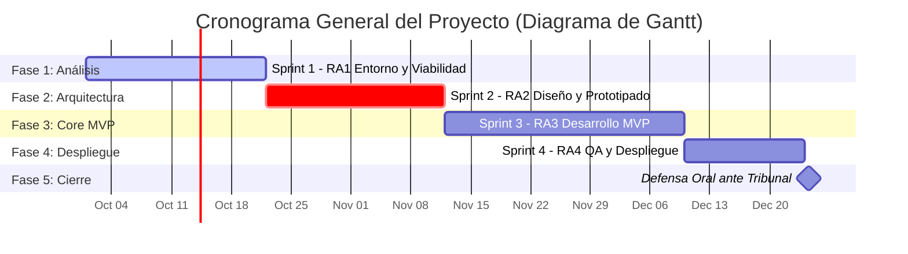

* **Ejemplos por Ciclo Formativo:**
  * **DAM:** Planificación de sprints de diseño de prototipos Figma, desarrollo de base de datos local, integración de vistas, conexión con API backend y fase final de pruebas en emuladores/móviles reales.
  * **DAW:** Cronograma con hitos de diseño de esquema de BD, desarrollo de endpoints de API, maquetación de componentes frontend, integración con pasarelas y despliegue continuo en entorno Staging/Production.
  * **ASIR:** Cronograma dividiendo el aprovisionamiento de hypervisores, configuración de VLANs/túneles VPN, despliegue de scripts de automatización Ansible/Terraform, bastionado de seguridad y pruebas de carga.

---

### CE.d — Definición de Objetivos (SMART), Alcance y Métricas de Éxito

* **Objetivo Curricular:** Se han establecido los objetivos que se pretenden conseguir identificando su alcance.
* **Explicación Profunda:** Definición formal de los Objetivos Generales y Específicos del proyecto redactados bajo la metodología **SMART** (*Specific, Measurable, Achievable, Relevant, Time-bound*), vinculándolos con métricas de éxito e indicadores clave de rendimiento (KPIs).
  * **Estructura de Objetivos SMART:**
    * **S** (Específico): ¿Qué se va a lograr exactamente?
    * **M** (Medible): ¿Cómo se cuantificará el éxito?
    * **A** (Alcanzable): ¿Es realista con los medios disponibles?
    * **R** (Relevante): ¿Aporta valor real a la problemática detectada?
    * **T** (Delimitado en tiempo): ¿En qué fecha o Sprint se debe conseguir?

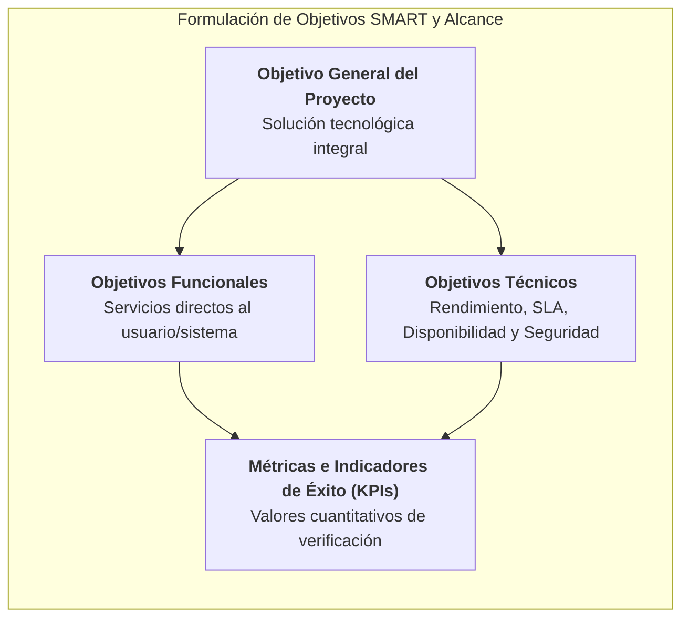

* **Ejemplos por Ciclo Formativo:**
  * **DAM:** *Objetivo SMART:* "Desarrollar una aplicación móvil multiplataforma en Flutter que permita completar una inspección técnica en menos de 2 minutos sin conexión a internet, sincronizando los datos en menos de 5 segundos tras recuperar cobertura 4G/5G antes de finalizar el Sprint 3."
  * **DAW:** *Objetivo SMART:* "Implementar una plataforma web SaaS en Next.js capaz de procesar 500 solicitudes por segundo con un tiempo de respuesta de servidor inferior a 200ms y disponibilidad del 99.9% medida durante la Demo del Sprint 3."
  * **ASIR:** *Objetivo SMART:* "Desplegar una infraestructura cloud redundante mediante Terraform con un tiempo de conmutación por error (*Failover*) inferior a 3 segundos y cumplimiento del 100% de las directivas de bastionado CIS Benchmark al término del Sprint 2."

---

### CE.e — Desglose de Actividades, EDT/WBS y Planificación de Tareas

* **Objetivo Curricular:** Se han determinado las actividades necesarias para el desarrollo del proyecto.
* **Explicación Profunda:** Elaboración de la **Estructura de Desglose del Trabajo (EDT / WBS - Work Breakdown Structure)**, dividiendo jerárquicamente el proyecto en paquetes de trabajo (*Work Packages*) y tarjetas de tareas técnicas asociadas al Backlog del proyecto.
  * **Niveles de la EDT/WBS:**
    * *Nivel 1:* Proyecto Global
    * *Nivel 2:* Sprints / Fases Principales
    * *Nivel 3:* Entregables / Módulos Técnicos
    * *Nivel 4:* Paquetes de Trabajo / Tareas Técnicas e Historias de Usuario

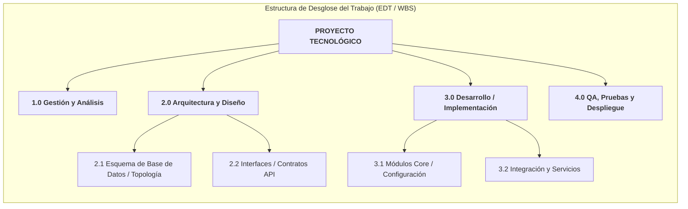

* **Ejemplos por Ciclo Formativo:**
  * **DAM:** EDT dividida en paquetes de UI Wireframing, arquitectura de estado local, módulo de base de datos SQLite/Room, servicios de sincronización en segundo plano y paquete de pruebas de interfaz.
  * **DAW:** EDT desglosada en paquetes de diseño de modelos ORM/Base de Datos, endpoints de la API REST/GraphQL, componentes UI de frontend, middleware de autenticación y pipeline de integración continua.
  * **ASIR:** EDT estructurada en paquetes de diseño de red VLAN/Subredes, aprovisionamiento de nodos en hipervisor/cloud, scripts de automatización Ansible, configuración de cortafuegos y sistema de monitorización/alertas.

---

### CE.f — Determinación y Estimación de Recursos Materiales y Personales

* **Objetivo Curricular:** Se han previsto los recursos materiales y personales necesarios para realizar el proyecto.
* **Explicación Profunda:** Identificación, cuantificación y asignación de todos los activos necesarios para ejecutar el proyecto, clasificándolos en **Recursos Humanos / Roles** y **Recursos Materiales / Infraestructura / Software**.
  * **Tipología de Recursos:**
    * *Recursos Personales:* Asignación de roles técnicos mediante la **Matriz RACI** (*Responsible, Accountable, Consulted, Informed*).
    * *Recursos Hardware / Materiales:* Equipos de cómputo, servidores, dispositivos móviles de prueba, cabinas de almacenamiento, equipos de red.
    * *Recursos Software e Infraestructura Cloud:* Entornos IDE, licencias comerciales/open-source, instancias cloud, dominios, certificados SSL.

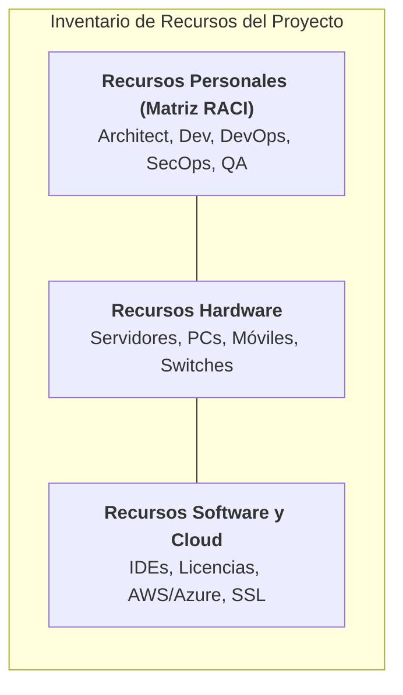

* **Ejemplos por Ciclo Formativo:**
  * **DAM:** Asignación de rol de Lead Mobile Developer, requerimiento de dispositivos de prueba físicos (móvil Android API 33+, iPhone iOS 17+), licencia de cuenta de desarrollador Apple/Google e IDEs Android Studio/Xcode.
  * **DAW:** Asignación de rol de Full-Stack Architect, entornos de desarrollo local Docker, dominios `.com`/`.es`, certificados Let's Encrypt y servidores de prueba Staging en Vercel/AWS.
  * **ASIR:** Asignación de roles de Network Engineer y SysAdmin, requerimiento de servidor físico para hipervisor Proxmox (64GB RAM, 2TB SSD RAID1), switches gestionables, cortafuegos pfSense y licencias de evaluación o suscripciones Cloud en AWS/Azure.

---

### CE.g — Presupuesto, Análisis de Costes (CAPEX/OPEX) y Necesidades de Financiación

* **Objetivo Curricular:** Se han identificado las necesidades de financiación para la puesta en marcha del proyecto.
* **Explicación Profunda:** Elaboración del presupuesto económico consolidado del proyecto, diferenciando entre inversiones de capital (**CAPEX**) y costes operativos continuados (**OPEX**), calculando el coste de mano de obra por hora de ingeniería y determinando las necesidades de liquidez/financiación.
  * **Desglose Presupuestario Profesional:**
    * **CAPEX (Capital Expenditures):** Inversiones iniciales amortizables (compra de hardware, equipos, licencias perpetuas, registro de marcas).
    * **OPEX (Operational Expenditures):** Gastos recurrentes de operación (alquiler de servidores cloud, suscripciones SaaS, certificados, consumo eléctrico, mantenimiento).
    * **Costes de Personal:** Cálculo del coste hora/hombre de ingeniería aplicado a las horas estimadas de desarrollo.

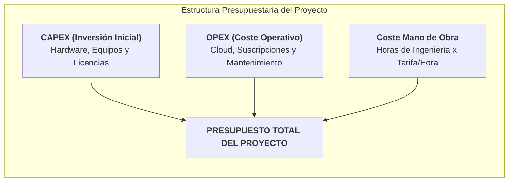

* **Ejemplos por Ciclo Formativo:**
  * **DAM:** Presupuesto calculando 300 horas de desarrollo a 35€/hora, coste de licencias Apple Developer (99$/año) y Google Play (25$ pago único), amortización del PC de desarrollo y consumo de servicios Cloud de backend (Firebase/Supabase).
  * **DAW:** Presupuesto desglosando 350 horas de ingeniería Full-Stack a 40€/hora, costes OPEX de infraestructura en AWS (instancias EC2, RDS PostgreSQL, S3) a 85€/mes, dominio y servicios de envío de emails transaccionales.
  * **ASIR:** Presupuesto cuantificando la compra del servidor de virtualización físico (CAPEX: 2.200€), switches y SAI, coste de las horas de instalación y bastionado (250h a 38€/h), y licencias u OPEX de conectividad de fibra/VPN dedicada.

---

### CE.h — Diseño de Arquitectura, Diagramas Técnicos y Documentación del Proyecto

* **Objetivo Curricular:** Se ha definido y elaborado la documentación necesaria para su diseño.
* **Explicación Profunda:** Es la sección central del Capítulo 2. El alumno/a debe elaborar la **especificación técnica formal de la arquitectura del proyecto** utilizando diagramas estandarizados según su especialidad (UML, esquemas de red L2/L3, modelos de datos ER/NoSQL y prototipos de interfaz UI/UX).
  * **Entregables Técnicos por Especialidad:**
    * *Sistemas Software (DAM/DAW):* Diagramas UML (Clases, Componentes, Secuencia), Modelo Entidad-Relación (ER) de la Base de Datos, Contrato de la API (OpenAPI / Swagger) y Wireframes/Mockups de las pantallas.
    * *Sistemas de Infraestructura y Redes (ASIR):* Diagrama de Topología L2/L3 de Red, Diagrama de Arquitectura Cloud / Virtualización, Tabla de Direccionamiento IP y Subredes, Esquema de Flujo de Tráfico y Reglas de Firewall.

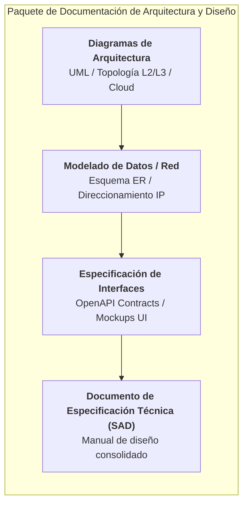

* **Ejemplos por Ciclo Formativo:**
  * **DAM:**
    * Diagrama de Arquitectura de la App (Clean Architecture: Presentation, Domain, Data layers).
    * Diagrama de Clases UML del modelo de dominio.
    * Modelo Entidad-Relación de la base de datos local SQLite/Room.
    * Wireframes / Mockups interactivos creados en Figma para los flujos principales de la pantalla.
  * **DAW:**
    * Diagrama de Componentes de la Arquitectura Full-Stack (Frontend React/Next.js $\leftrightarrow$ API REST Node.js $\leftrightarrow$ PostgreSQL / Redis).
    * Modelo ER relacional completo en tercera forma normal (3FN).
    * Especificación OpenAPI 3.0 / Swagger de los endpoints de la API.
    * Layouts UI/UX responsive para versiones desktop y mobile PWA.
  * **ASIR:**
    * Esquema de Topología de Red L2/L3 (Capa de Acceso, Distribución, Núcleo, DMZ, Red Interna y WAN).
    * Diagrama de Infraestructura de Virtualización / Clúster Proxmox / K3s.
    * Tabla completa de subredes, VLANs, rangos DHCP e IP estáticas.
    * Matriz de Reglas de Cortafuegos (Origen, Destino, Puerto, Protocolo, Acción Allow/Deny).

---

### CE.i — Plan de Control de Calidad, Pruebas y Gestión de Incidencias

* **Objetivo Curricular:** Se han identificado los aspectos que se deben controlar para garantizar la calidad del proyecto.
* **Explicación Profunda:** Definición del **Plan de Garantía de Calidad (QA Plan)** que se aplicará durante las fases de desarrollo y despliegue, estableciendo la estrategia de pruebas, los procedimientos de revisión y los protocolos de gestión de incidencias/bugs.
  * **Estrategias de Control de Calidad:**
    * *Niveles de Pruebas:* Unitarias, de Integración, de Sistema, de Rendimiento/Estrés y de Seguridad (OWASP / Bastionado).
    * *Métricas de Calidad:* Cobertura de código (*Code Coverage* $> 80\%$), tiempo medio entre fallos (MTBF), tiempo medio de reparación (MTTR).
    * *Gestión de Incidencias:* Flujo de vida de los fallos (*Open $\rightarrow$ In Progress $\rightarrow$ Resolved $\rightarrow$ Verified*) en la herramienta de seguimiento.

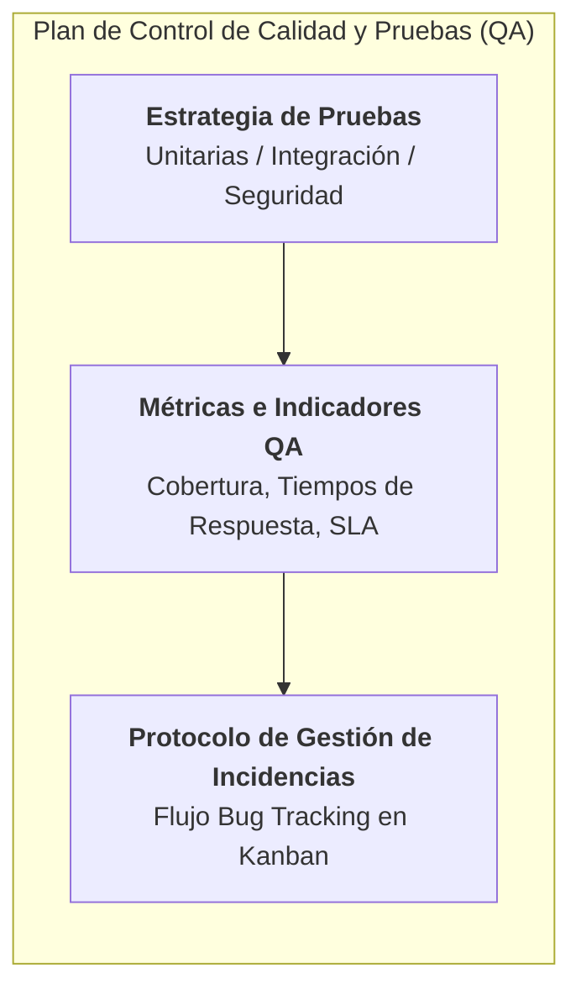

* **Ejemplos por Ciclo Formativo:**
  * **DAM:** Plan de pruebas unitarias con JUnit/Mockito, pruebas de interfaz automatizadas con Espresso/Flutter Driver, pruebas de rendimiento de memoria/batería y protocolo de registro de crash en Firebase Crashlytics.
  * **DAW:** Estrategia de pruebas unitarias y de integración con Jest/Vitest, pruebas End-to-End (E2E) con Cypress/Playwright, análisis estático de código con ESLint/SonarQube y escaneo de vulnerabilidades con OWASP ZAP.
  * **ASIR:** Plan de pruebas de conectividad y velocidad con Iperf3, pruebas de conmutación por error en el clúster (*Failover Testing*), auditorías de seguridad con Nmap/OpenVAS y verificación de reglas de cortafuegos.

---

## 5. Ejecución Práctica de la Arquitectura y Prototipado (Demo Funcional 2)

Al finalizar el Sprint 2, además del documento de la **Memoria v2.0**, el alumno/a debe presentar en vivo el **Prototipo de Arquitectura / Esquema Interactivo** correspondiente a su proyecto:

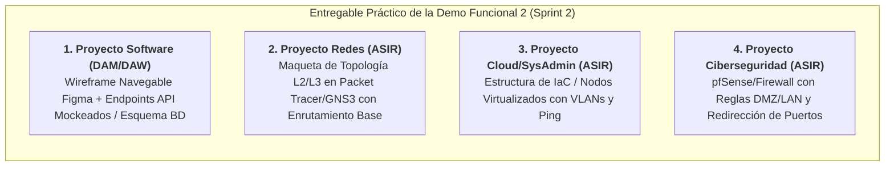

### Detalle de Requisitos de la Demo Funcional 2 por Ámbito Técnico:

#### 1. Proyectos de Desarrollo Software (DAM / DAW)
* **Demostración en Vivo (3 min):**
  * Presentación del **Prototipo Navegable UI/UX** (Figma / Adobe XD) mostrando el flujo completo de pantallas y la experiencia de usuario.
  * Muestra del **Esquema de Base de Datos** creado e importado en el gestor (PostgreSQL, MySQL, MongoDB, SQLite).
  * Ejecución de llamadas a la **API / Endpoints** desde Postman/Swagger mostrando la estructura de respuestas JSON según el contrato diseñado.

#### 2. Proyectos de Redes y Telecomunicaciones (ASIR)
* **Demostración en Vivo (3 min):**
  * Exposición de la **Topología L2/L3** en el simulador (Packet Tracer / GNS3 / EVE-NG) con todos los switches, routers y cortafuegos etiquetados.
  * Muestra de la tabla de VLANs y ejecuciones de `ping` / `traceroute` cruzados entre distintas subredes demostrando el aislamiento y filtrado deseado.

#### 3. Proyectos de Cloud, Virtualización y SysAdmin (ASIR)
* **Demostración en Vivo (3 min):**
  * Muestra del entorno de **Virtualización / Clúster** (Proxmox / VMware / AWS) con las máquinas virtualizadas y las redes virtuales configuradas.
  * Ejecución de scripts de aprovisionamiento de **Infraestructura como Código (IaC)** (Terraform/Ansible) mostrando la creación o configuración automatizada de un recurso.

---

## 6. Matriz de Entregables en Moodle y Demo Funcional Presencial (Sprint 2)

Para completar con éxito el Sprint 2, el alumno/a debe subir a Moodle los siguientes tres elementos:

| # | Elemento Entregable | Formato / Enlace | Descripción |
| :-: | :--- | :--- | :--- |
| **1** | **Memoria Incremental v2.0** | Archivo `.pdf` | Capítulo 1 Consolidado + Capítulo 2 redactado respondiendo íntegramente a los 9 Criterios de Evaluación del RA2. |
| **2** | **Tablero Digital Actualizado** | URL Pública | Enlace a GitHub Projects, Trello o Jira con las tareas de Arquitectura y Diseño asignadas en el Backlog. |
| **3** | **Artefacto de Diseño / Repositorio** | URL / Archivo | Enlace a Figma (mockups), repositorio Git con esquemas IaC/OpenAPI o archivo `.pkt`/diagramas de red. |

> 🎙️ **Hito Presencial Obligatorio (Demo Funcional 2):** Presentación individual in situ de 3 minutos ante el profesor demostrando en vivo el prototipo de interfaz, el esquema de arquitectura o la maqueta de red para obtener la calificación de **Apto** en el Sprint 2.

---

## 7. Checklist de Autoevaluación para el Alumnado (Sprint 2)

Antes de realizar la entrega en Moodle, verifica que cumples con todos los puntos:

- [ ] He incorporado las correcciones del **Sprint 1** en el Capítulo 1 de la Memoria v2.0.
- [ ] La **Memoria v2.0** incluye las 9 secciones asociadas a los criterios **CE.a al CE.i** del RA2.
- [ ] El **CE.c** incluye el **Diagrama de Gantt** con los plazos y fases de ejecución.
- [ ] El **CE.d** contiene los **Objetivos SMART** y las métricas/KPIs de éxito.
- [ ] El **CE.e** presenta el esquema gráfico de la **Estructura de Desglose del Trabajo (EDT / WBS)**.
- [ ] El **CE.g** incluye el desglose de costes **CAPEX / OPEX** y coste hora/hombre.
- [ ] El **CE.h** incluye todos los **diagramas de arquitectura** (UML, topología de red, modelo ER, OpenAPI o Figma).
- [ ] El **CE.i** detalla el plan de pruebas QA y el protocolo de gestión de incidencias.
- [ ] Tengo listo el **prototipo navegable / maqueta de red** para la **Demo Funcional 2** en vivo.
