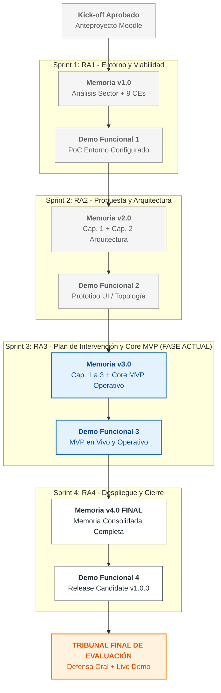
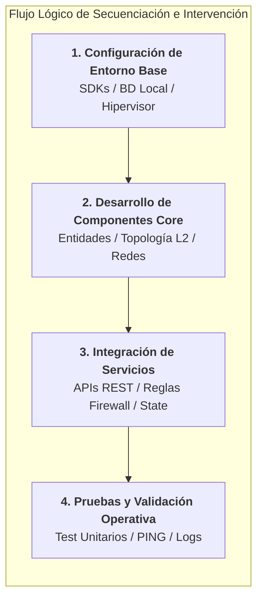
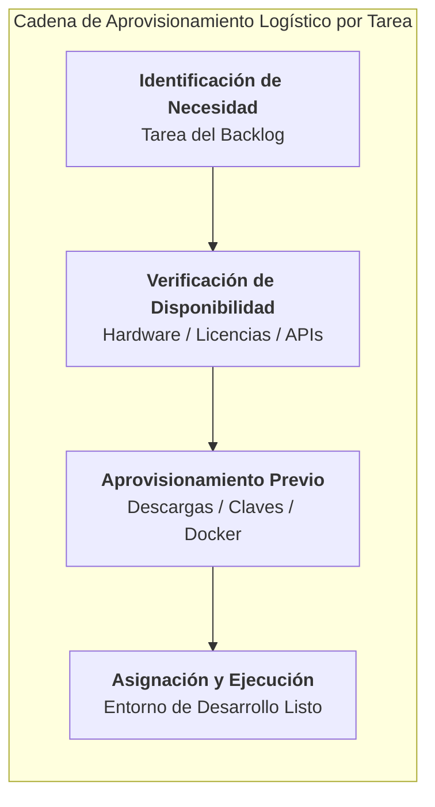
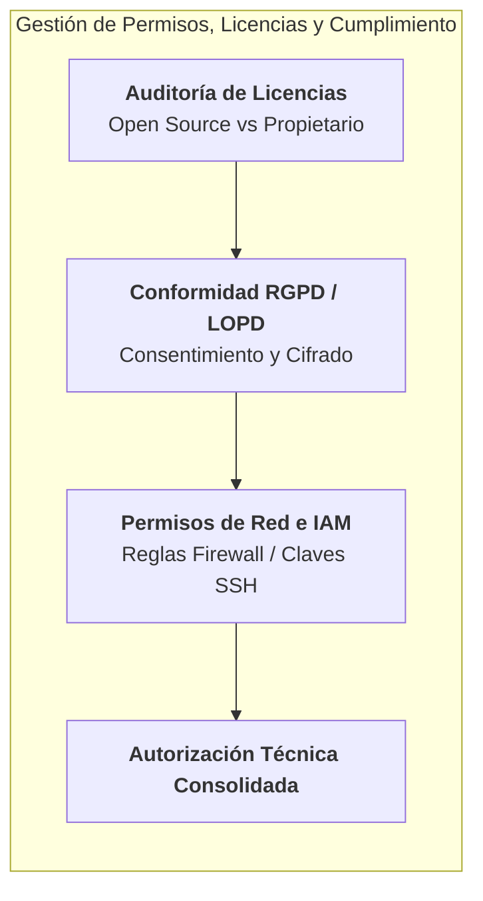
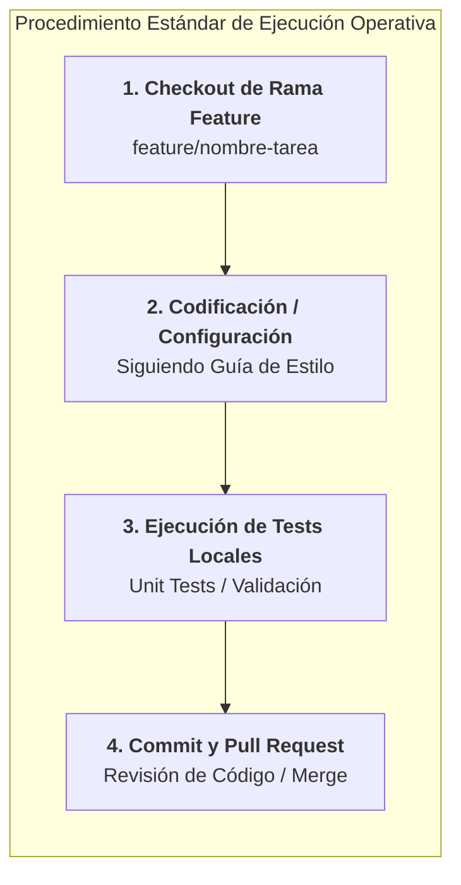
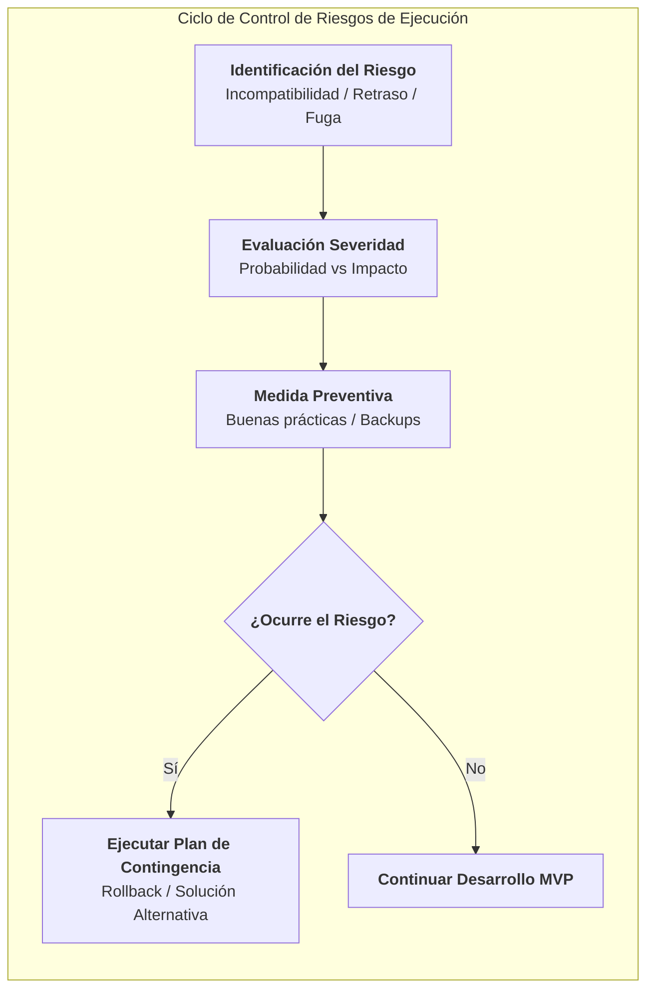
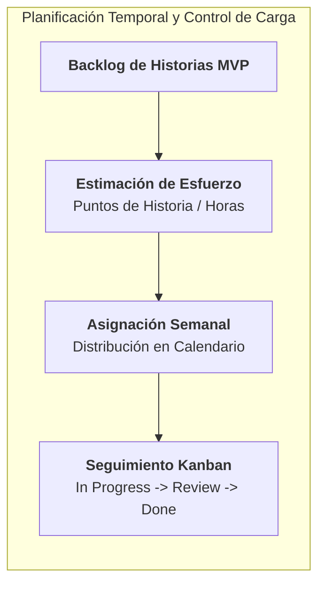
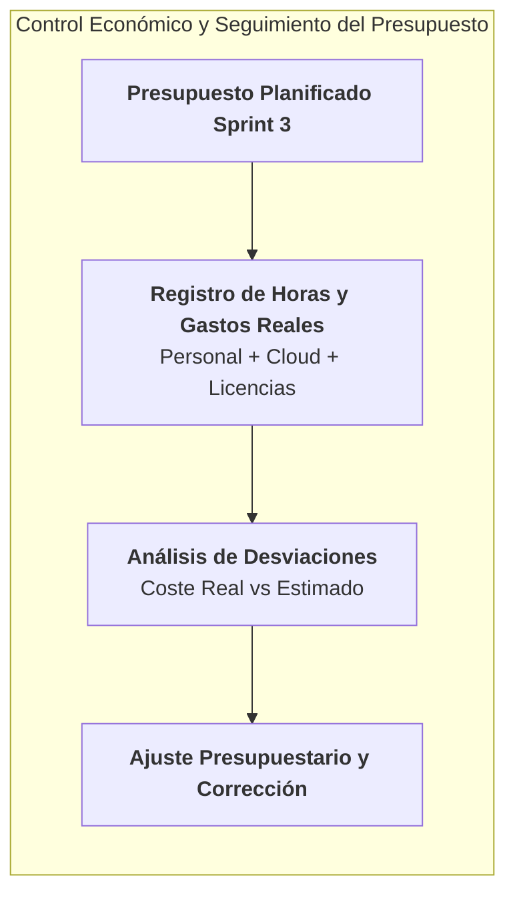
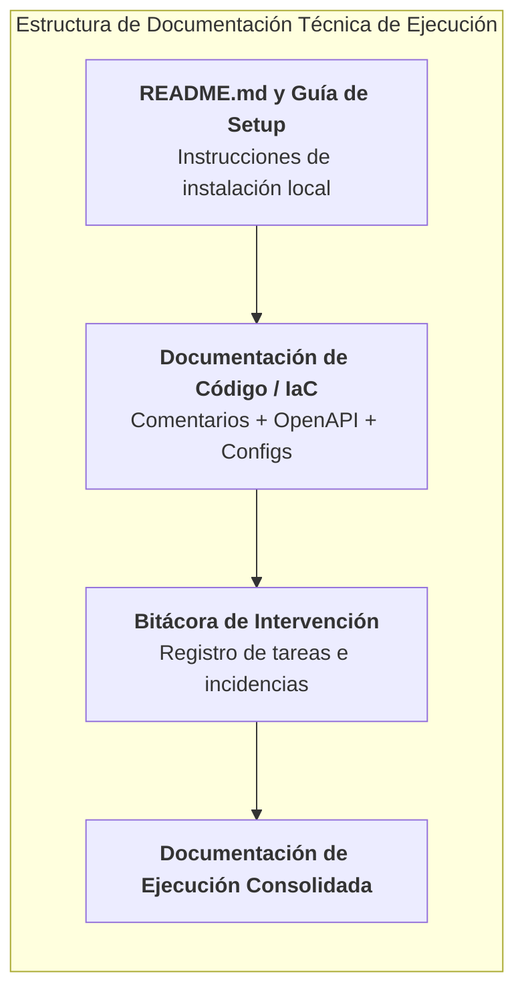

# 🚀 RA3. Planifica la ejecución del proyecto, determinando el plan de intervención y la documentación asociada.

> **Módulo Profesional:** Proyecto Intermodular / Proyecto Integrado (DAM / DAW / ASIR)  
> **Ámbito:** Cualquier Tipología de Proyecto Tecnológico (Desarrollo Software Web/Móvil/Desktop, Infraestructura Cloud/On-Premise, Redes Nacionales e Internacionales, Ciberseguridad/SOC, Data/IA, IoT o Sistemas Embebidos)  
> **Fase del Proyecto:** Sprint 3 | **Entregable:** Memoria Incremental v3.0 (Capítulos 1 y 2 Consolidados + Capítulo 3: Plan de Intervención, Secuenciación y Ejecución del MVP)  
> **Rol del Alumno/a:** *Architect / Technical Lead / Lead Developer / DevOps / SecOps / SysAdmin* (Responsable Único del Proyecto)  
> **Rol del Docente:** *Guía Metodológico, Orientador Técnico y Evaluador / Tribunal*

---

## 📋 Índice
1. [Enfoque del Proyecto (Sprint 3 — Core MVP y Plan de Intervención)](#1-enfoque-del-proyecto-sprint-3--core-mvp-y-plan-de-intervención)
2. [Ciclo de Vida Incremental del Proyecto (Fase RA3)](#2-ciclo-de-vida-incremental-del-proyecto-fase-ra3)
3. [Prerrequisito Obligatorio: Consolidación del Sprint 2](#3-prerrequisito-obligatorio-consolidación-del-sprint-2)
4. [Desglose Criterio por Criterio (CE.a al CE.h)](#4-desglose-criterio-por-criterio-cea-al-ceh)
   - [CE.a — Secuenciación de Tareas y Dependencias de Implementación](#ce-a--secuenciación-de-tareas-y-dependencias-de-implementación)
   - [CE.b — Determinación de Recursos y Logística por Tarea](#ce-b--determinación-de-recursos-y-logística-por-tarea)
   - [CE.c — Gestión de Permisos, Licencias y Autorizaciones Legales/Técnicas](#ce-c--gestión-de-permisos-licencias-y-autorizaciones-legalestécnicas)
   - [CE.d — Procedimientos de Actuación y Ejecución Operativa](#ce-d--procedimientos-de-actuación-y-ejecución-operativa)
   - [CE.e — Identificación de Riesgos de Ejecución y Plan de Prevención/Contingencia](#ce-e--identificación-de-riesgos-de-ejecución-y-plan-de-prevencióncontingencia)
   - [CE.f — Planificación Temporal y Asignación de Recursos Materiales y Humanos](#ce-f--planificación-temporal-y-asignación-de-recursos-materiales-y-humanos)
   - [CE.g — Valoración Económica y Control de Costes por Sprint](#ce-g--valoración-económica-y-control-de-costes-por-sprint)
   - [CE.h — Documentación Técnica de Ejecución y Plan de Intervención](#ce-h--documentación-técnica-de-ejecución-y-plan-de-intervención)
5. [Ejecución Práctica del Core MVP y Demostración (Demo Funcional 3)](#5-ejecución-práctica-del-core-mvp-y-demostración-demo-funcional-3)
6. [Matriz de Entregables en Moodle y Demo Funcional Presencial (Sprint 3)](#6-matriz-de-entregables-en-moodle-y-demo-funcional-presencial-sprint-3)
7. [Checklist de Autoevaluación para el Alumnado (Sprint 3)](#7-checklist-de-autoevaluación-para-el-alumnado-sprint-3)

---

## 1. Enfoque del Proyecto (Sprint 3 — Core MVP y Plan de Intervención)

En esta tercera fase del proyecto, el alumno/a da el paso decisivo desde los planos técnicos y la arquitectura (Sprint 2 / RA2) hacia la **construcción activa del Producto Mínimo Viable (MVP)** y la **ordenación procedimental de todas las tareas de intervención**.

Independientemente del ciclo formativo, el Sprint 3 exige poner en funcionamiento el núcleo operativo de la solución tecnológica, aplicar protocolos claros de ejecución, controlar la logística de recursos y gestionar de forma proactiva los riesgos que surgen durante el desarrollo real:

### 📱 Desarrollo de Software Multiplataforma (DAM)
* **Desarrollo del Core MVP:** Codificación de los módulos principales de la aplicación en Kotlin, Swift, Flutter o React Native.
* **Persistencia y Sincronización:** Implementación de bases de datos locales (Room, SQLite, Realm) y lógica *offline-first*.
* **Lógica de Negocio e Integración:** Conexión con APIs backend, gestión de estados y controladores.
* **Módulos Avanzados:** Integración de modelos de IA en dispositivo (*On-device AI*) o controladores para IoT/hardware (Rust, MicroPython).
* **Gestión de Entornos de Compilación:** Configuración de SDKs, emuladores y firmas digitales de desarrollo.

### 🌐 Desarrollo de Aplicaciones Web (DAW)
* **Desarrollo Full-Stack:** Implementación de arquitectura Next.js, Nuxt o SvelteKit con componentes reactivos.
* **Construcción de APIs y Backend:** Programación de endpoints REST, GraphQL o gRPC con controladores, middlewares y validaciones.
* **Capa de Persistencia:** Migraciones de base de datos relacional (PostgreSQL, MySQL) o NoSQL (MongoDB, Redis) e integración ORM/Prisma.
* **Servicios Inteligentes:** Integración funcional de modelos LLM, embeddings y pipelines RAG (*Retrieval-Augmented Generation*).
* **Entornos de Pruebas Web:** Servidores de desarrollo local, contenedores Docker de soporte y gestión de variables de entorno (`.env`).

### 🖥️ Administración de Sistemas Informáticos y Redes (ASIR)
* **Aprovisionamiento y Despliegue de Infraestructura:** Ejecución de automatizaciones con IaC (Terraform, Ansible) sobre Proxmox, AWS, Azure o GCP.
* **Configuración de Redes y Conectividad:** Implementación de topologías VLAN/Subredes, enrutamiento dinámico, túneles VPN IPSec/WireGuard y SD-WAN.
* **Despliegue de Servicios y Contenedores:** Configuración de clústeres Docker / Kubernetes (K3s), servicios de directorio (LDAP/Active Directory) y almacenamiento distribuido.
* **Bastionado y Ciberseguridad Activa:** Aplicación de políticas de cortafuegos (pfSense, iptables), reglas Zero-Trust y gestión de certificados SSL/TLS.
* **Puesta en Marcha de Observabilidad:** Instalación de agentes de monitoreo (Prometheus, Grafana, Zabbix) y centralización de logs.

---

## 2. Ciclo de Vida Incremental del Proyecto (Fase RA3)

El documento del estudiante evoluciona a la **Memoria v3.0**, integrando los Capítulos 1 y 2 consolidados con las correcciones del tribunal e incorporando íntegramente el **Capítulo 3 (Plan de Intervención, Secuenciación y Ejecución)**.

---

## 3. Prerrequisito Obligatorio: Consolidación del Sprint 2

Antes de iniciar las actividades del Sprint 3, el alumno/a debe haber superado los siguientes hitos de control:

1. **Memoria v2.0 Corregida:** Haber aplicado todas las correcciones indicadas por el docente/tribunal sobre los diagramas de arquitectura, el diseño de base de datos/red y la presupuestación del Capítulo 2.
2. **Prototipo / Diseño Validado:** Contar con el visto bueno del prototipo interactivo (Figma) o de la topología lógica de red para proceder a la codificación o aprovisionamiento definitivo.
3. **Product Backlog Refinado:** Tener desglosadas las historias de usuario y tareas de implementación en el tablero Kanban (GitHub Projects, Jira, Trello) priorizadas con etiquetas de esfuerzo y dependencia.

---

## 4. Desglose Criterio por Criterio (CE.a al CE.h)

### CE.a — Secuenciación de Tareas y Dependencias de Implementation

* **Objetivo Curricular:** Se han secuenciado las tareas en función de las necesidades de implementación.
* **Explicación Profunda:** Ordenación lógica y cronológica del plan de trabajo técnico para garantizar que cada componente se construye sobre sus prerrequisitos tecnológicos. El alumno/a debe identificar las dependencias de implementación (ej. esquema de BD listo antes de crear repositorios ORM; VLANs creadas antes de aplicar reglas de cortafuegos) evitando bloqueos en el flujo de desarrollo.
  * **Tipos de Dependencias Técnicas:**
    * *Fin a Inicio (FI):* La tarea B no puede comenzar hasta que la tarea A ha finalizado por completo.
    * *Inicio a Inicio (II):* Dos tareas que deben arrancar de forma simultánea.
    * *Fin a Fin (FF):* Tareas que deben concluir de forma coordinada (ej. pruebas y documentación).

* **Ejemplos por Ciclo Formativo:**
  * **DAM:** Secuenciación: 1) Creación de entidades Room/SQLite, 2) Implementación de DAO y repositorios, 3) Programación de ViewModels/Estado, 4) Maquetación de pantallas UI en Jetpack Compose/SwiftUI.
  * **DAW:** Secuenciación: 1) Definición de esquemas de base de datos y migraciones Prisma, 2) Creación de endpoints API backend, 3) Middleware de autenticación JWT, 4) Integración del frontend con Fetch/SWR.
  * **ASIR:** Secuenciación: 1) Creación de VLANs y direccionamiento en switch virtual, 2) Aprovisionamiento de VMs con Terraform, 3) Ejecución de playbooks Ansible para instalar servicios, 4) Configuración de reglas de cortafuegos pfSense.

---

### CE.b — Determinación de Recursos y Logística por Tarea

* **Objetivo Curricular:** Se han determinado los recursos y la logística necesaria para cada tarea.
* **Explicación Profunda:** Asignación explícita de las herramientas, licencias, hardware, espacio de almacenamiento, entornos de ejecución y conectividad requeridos para la ejecución individual de cada paquete de trabajo. La logística contempla la previsión de aprovisionamiento previo para evitar paradas en el desarrollo.
  * **Dimensiones Logísticas:**
    * *Recursos Tecnológicos:* Claves API, credenciales de entorno cloud, repositorios Git, SDKs y compiladores.
    * *Recursos Hardware y Red:* Ancho de banda, tarjetas de red, memoria RAM dedicada en máquinas virtuales o dispositivos físicos IoT.
    * *Suministros y Espacios:* Entornos de laboratorio, salas de reunión o espacios de pruebas.

* **Ejemplos por Ciclo Formativo:**
  * **DAM:** Asignación de emuladores con versión específica de Android (API 34) y dispositivos físicos de pruebas (iOS/Android), junto con claves de desarrollador y tokens de APIs de mapas/geolocalización.
  * **DAW:** Disponibilidad de contenedores Docker con PostgreSQL y Redis en local, variables de entorno con API Keys de OpenAI/Anthropic y cuentas de prueba en proveedores CDN.
  * **ASIR:** Asignación de ISOs verificadas de Linux/Windows Server, reserva de direcciones IP públicas/privadas en la red de laboratorio, y provisión de credenciales SSH e hipervisores Proxmox/VMware con recursos de CPU/RAM reservados.

---

### CE.c — Gestión de Permisos, Licencias y Autorizaciones Legales/Técnicas

* **Objetivo Curricular:** Se han identificado las necesidades de permisos y autorizaciones para llevar a cabo las tareas.
* **Explicación Profunda:** Identificación y gestión de las autorizaciones administrativas, cumplimiento de normativas de protección de datos (RGPD / LOPD-GDD), licencias de software Open Source o propietario y permisos de acceso a sistemas e infraestructuras.
  * **Marco de Autorizaciones:**
    * *Licenciamiento de Software:* Verificación de compatibilidad de licencias (MIT, Apache 2.0, GPLv3 vs. Propietarias).
    * *Privacidad por Diseño:* Consentimiento explícito de usuarios, cláusulas informativas y cifrado de datos personales.
    * *Permisos de Red y Sistemas:* Puertos autorizados en cortafuegos, políticas IAM y claves SSH institucionales.

* **Ejemplos por Ciclo Formativo:**
  * **DAM:** Verificación de licencias de librerías de terceros (UI kits), permisos solicitados en el manifiesto de la app (Cámara, Ubicación, Notificaciones) según guías de privacidad de Android/iOS.
  * **DAW:** Política de cookies y banner de consentimiento RGPD, aviso legal, términos de uso para SaaS y auditoría de licencias en dependencias de `package.json` (`npm audit`).
  * **ASIR:** Licenciamiento de SO (Windows Server / RHEL), autorizaciones de rango de red en el ISP, políticas de acceso Zero-Trust en el bastionado SSH y certificados SSL/TLS emitidos por Let's Encrypt.

---

### CE.d — Procedimientos de Actuación y Ejecución Operativa

* **Objetivo Curricular:** Se han determinado los procedimientos para ejecución de las tareas.
* **Explicación Profunda:** Definición de los Estándares Operativos de Trabajo (SOP - *Standard Operating Procedures*), guías paso a paso y convenciones técicas que debe seguir el alumno/a para realizar las actividades con calidad profesional y de forma repetible.
  * **Componentes de un Procedimiento Técnico:**
    * *Estrategia de Ramas Git:* Uso de GitFlow o Feature-Branching (`main`, `develop`, `feature/xyz`).
    * *Estilo y Calidad de Código:* Guías de estilo (ESLint, Linter, PEP8), convenciones de commits y formato.
    * *Procedimientos de Despliegue/Configuración:* Scripts bash/ansible para aprovisionamiento automatizado.

* **Ejemplos por Ciclo Formativo:**
  * **DAM:** Procedimiento de creación de pantallas: 1) Crear paquete del módulo, 2) Definir estado en Sealed Class, 3) Implementar ViewModel con Flow/LiveData, 4) Conectar Composables/Views, 5) Pasar Linter de Kotlin.
  * **DAW:** Procedimiento para nuevo endpoint: 1) Definir esquema Zod/Pydantic, 2) Crear ruta y controlador, 3) Añadir servicio con llamadas a base de datos, 4) Documentar en Swagger/OpenAPI, 5) Probar en Postman.
  * **ASIR:** Procedimiento de despliegue de VM: 1) Modificar variables en Terraform (`main.tf`), 2) Validar sintaxis (`terraform validate`), 3) Aplicar plan (`terraform apply`), 4) Ejecutar playbook Ansible de bastionado.

---

### CE.e — Identificación de Riesgos de Ejecución y Plan de Prevención/Contingencia

* **Objetivo Curricular:** Se han identificado los riesgos inherentes a la ejecución del proyecto, definiendo el plan de prevención de riesgos y los medios necesarios.
* **Explicación Profunda:** Identificación proactiva de los problemas técnicos, temporales y operativos que pueden surgir durante la construcción del MVP, estableciendo **Medidas Preventivas** (para evitar que ocurra) y **Acciones de Contingencia** (plan B si el riesgo se materializa).
  * **Tipologías de Riesgos de Ejecución:**
    * *Técnicos:* Incompatibilidad de librerías, fallos de compilación, sobrecostes de API, caídas de servidores.
    * *Temporales:* Subestimación de tiempo en tareas complejas, cuellos de botella por dependencias.
    * *Seguridad:* Fuga de credenciales (`.env` subido a Git), vulnerabilidades en librerías.

* **Ejemplos por Ciclo Formativo:**
  * **DAM:** *Riesgo:* Incompatibilidad de una librería de mapas en iOS. *Prevención:* Crear una capa de abstracción sobre la librería. *Contingencia:* Cambiar a la solución nativa MapKit/Google Maps.
  * **DAW:** *Riesgo:* Agotamiento de cuota gratuita en pasarela de pago o LLM. *Prevención:* Implementar respuestas mockeadas en entorno local. *Contingencia:* Usar modelo local Ollama o proveedor secundario.
  * **ASIR:** *Riesgo:* Corrupción de máquina virtual en Proxmox durante el bastionado. *Prevención:* Crear Snapshots previos a cada cambio crítico. *Contingencia:* Restaurar el Snapshot en <5 minutos.

---

### CE.f — Planificación Temporal y Asignación de Recursos Materiales y Humanos

* **Objetivo Curricular:** Se ha planificado la asignación de recursos materiales y humanos según los tiempos de ejecución.
* **Explicación Profunda:** Distribución equilibrada de la carga de trabajo técnica a lo largo de las semanas del Sprint 3, asegurando que los recursos hardware, software y la dedicación horaria del alumno/a se gestionan de forma sostenible mediante el tablero Kanban y el cronograma del proyecto.
  * **Elementos de la Planificación Temporal:**
    * *Estimación en Horas/Puntos:* Asignación de esfuerzo a cada tarea del MVP.
    * *Control de Carga de Trabajo:* Evitar sobreasignación en días críticos.
    * *Hitos del Sprint:* Puntos de revisión intermedia del avance del MVP.

* **Ejemplos por Ciclo Formativo:**
  * **DAM:** Planificación de 3 semanas: Semana 1 (Estructura base y persistencia BD), Semana 2 (Lógica de negocio y maquetación UI), Semana 3 (Pruebas de interfaz y ajustes).
  * **DAW:** Planificación de 3 semanas: Semana 1 (Modelos de datos y endpoints backend), Semana 2 (Desarrollo de pantallas frontend e integración), Semana 3 (Autenticación, middleware y pruebas).
  * **ASIR:** Planificación de 3 semanas: Semana 1 (Topología L2/L3 y aprovisionamiento IaC), Semana 2 (Despliegue de servicios y contenedores K3s), Semana 3 (Políticas de seguridad, cortafuegos y Grafana).

---

### CE.g — Valoración Económica y Control de Costes por Sprint

* **Objetivo Curricular:** Se ha hecho la valoración económica que da respuesta a las condiciones de la ejecución del proyecto.
* **Explicación Profunda:** Control detallado del gasto real incurrido durante la fase de ejecución frente al presupuesto planificado en el Sprint 2, evaluando las desviaciones de costes de personal (horas invertidas), licencias consumidas e infraestructura cloud utilizada durante el desarrollo del MVP.
  * **Conceptos del Control Económico del Sprint:**
    * *Coste Estimado vs. Coste Real:* Comparación entre la previsión presupuestaria y los gastos efectivos.
    * *Costes de Infraestructura Cloud/Dev:* Consumo real de instancias EC2/S3, bases de datos o pasarelas.
    * *Fondo de Contingencia:* Uso justificado del margen de imprevistos ante emergencias técnicas.

* **Ejemplos por Ciclo Formativo:**
  * **DAM:** Seguimiento de coste de horas de desarrollo (40 horas x 25 €/h = 1.000 €) + licencia de Apple Developer (99 $/año prorrateada) + consumo de API Firebase/Supabase en capa gratuita (0 €).
  * **DAW:** Registro de coste de horas dev (45 horas x 25 €/h = 1.125 €) + consumo de base de datos alojada en Neon/Supabase (15 €) + API Tokens de modelos de IA (10 €).
  * **ASIR:** Control de horas de ingeniería SysAdmin (50 horas x 28 €/h = 1.400 €) + consumo de crédito en clúster AWS/DigitalOcean (30 €) + licencias de prueba o licencias Open Source (0 €).

---

### CE.h — Documentación Técnica de Ejecución y Plan de Intervención

* **Objetivo Curricular:** Se ha definido y elaborado la documentación necesaria para la ejecución del proyecto.
* **Explicación Profunda:** Compilación y redacción de toda la documentación técnica que respalda la construcción del MVP, incluyendo el manual de instalación/despliegue del entorno de desarrollo, especificación técnica de código/configuraciones y cuaderno de bitácora del plan de intervención.
  * **Documentos Técnicos de Ejecución:**
    * *Manual de Despliegue en Local (`README.md`):* Pasos para clonar, instalar dependencias, levantar variables de entorno y ejecutar la aplicación/infraestructura.
    * *Documentación de Código e Infraestructura:* Comentarios, especificaciones OpenAPI o ficheros de configuración documentados (`docker-compose.yml`, playbooks Ansible).
    * *Registros de Pruebas de Ejecución:* Informes de ejecución de test unitarios o pruebas de conectividad.

* **Ejemplos por Ciclo Formativo:**
  * **DAM:** `README.md` en repositorio Git detallando versión de Flutter/Android Studio, variables de entorno requeridas, comando de compilación (`flutter build apk` / `./gradlew assembleDebug`) y capturas del MVP en emulador.
  * **DAW:** Documentación de API Swagger interactiva accesible en `/api/docs`, archivo `README.md` con instrucciones para `npm install`, `npx prisma migrate dev` y `npm run dev`, y archivo `.env.example`.
  * **ASIR:** Documentación del repositorio IaC con `README.md` explicando la estructura de inventarios Ansible, comandos para ejecutar `terraform apply`, diagrama actualizado de la topología real desplegada y archivo de variables de ejemplo `vars.yml.example`.

---

## 5. Ejecución Práctica del Core MVP y Demostración (Demo Funcional 3)

Al finalizar el Sprint 3, además de entregar el documento escrito de la **Memoria v3.0**, el alumno/a debe presentar una **Demo Funcional en Vivo del Core MVP (3 minutos)** ante el docente/tribunal.

El objetivo de esta demostración no es mostrar un producto totalmente acabado ni pulido al 100%, sino probar que el **núcleo funcional de la solución está construido, ejecutándose en tiempo real sobre datos/infraestructura real y realizando las operaciones clave sin errores bloqueantes**.

---

### Detalle de Requisitos de la Demo Funcional 3 por Ámbito Técnico:

#### 1. Proyectos de Desarrollo Software (DAM / DAW)
* **Objetivo del MVP:** Demostrar el flujo principal de datos (*Happy Path*) de la aplicación funcionando en vivo.
* **Entorno de Demostración:** Emulador/dispositivo móvil en tiempo real o servidor web local/cloud ejecutando la aplicación.
* **Demostración en la Demo Funcional (3 min):**
  * **Flujo de Usuario Real:** Ejecución en vivo de la creación, lectura y actualización de un registro de datos (ej. registro de usuario, procesamiento de un formulario o reserva).
  * **Persistencia Comprobada:** Muestra de que los datos introducidos se guardan correctamente en la base de datos (SQLite/Room/PostgreSQL) y persisten tras reiniciar la app o recargar la página.
  * **Integración Activa:** Demostración de una llamada exitosa a la API backend o servicio de IA mostrando la respuesta HTTP 200 OK y el procesamiento del resultado en la interfaz.

#### 2. Proyectos de Redes y Telecomunicaciones (ASIR)
* **Objetivo del MVP:** Demostrar la segmentación de red, enrutamiento y aislamiento funcional entre zonas.
* **Entorno de Demostración:** Maqueta física o simulador de red (GNS3, EVE-NG, Packet Tracer) con nodos activos.
* **Demostración en la Demo Funcional (3 min):**
  * **Conectividad L2/L3:** Ejecución en vivo de pruebas de conectividad `ping` y `traceroute` entre equipos de la misma VLAN y entre diferentes subredes a través del router/firewall.
  * **Aislamiento de Seguridad:** Muestra del bloqueo efectivo de tráfico no autorizado entre VLANs de producción y DMZ/Gestión mediante reglas de cortafuegos.
  * **Asignación Dinámica:** Verificación de la entrega automática de direcciones IP mediante servidor DHCP configurado en la topología.

#### 3. Proyectos de Cloud, Virtualización y SysAdmin (ASIR)
* **Objetivo del MVP:** Demostrar el aprovisionamiento automatizado de servicios y la alta disponibilidad o monitorización.
* **Entorno de Demostración:** Servidor físico/hipervisor Proxmox VE o entorno Cloud (AWS/Azure) con recursos desplegados.
* **Demostración en la Demo Funcional (3 min):**
  * **Aprovisionamiento IaC:** Ejecución en directo de un comando `terraform apply` o playbook de Ansible mostrando la creación o configuración automática de un servicio.
  * **Servicio Operativo:** Acceso en vivo al servicio desplegado (ej. página web servida desde contenedor Nginx/Docker, clúster K3s respondiendo a `kubectl get nodes` o Active Directory autenticando a un usuario).
  * **Panel de Observabilidad:** Muestra del dashboard de Grafana/Prometheus en tiempo real reflejando el estado de uso de CPU, RAM y red de los nodos.

---

## 6. Matriz de Entregables en Moodle y Demo Funcional Presencial (Sprint 3)

| Entregable | Formato / Soporte | Ubicación | Descripción de Contenido |
| :--- | :--- | :--- | :--- |
| **Memoria Incremental v3.0** | Documento PDF | Tarea Moodle Sprint 3 | Capítulos 1 y 2 consolidados + **Capítulo 3 (Plan de Intervención, Secuenciación, Procedimientos y Ejecución del MVP)**. |
| **Código Fuente / Playbooks / Configs** | Repositorio Git | GitHub / GitLab | Código del Core MVP, archivos de migración de BD, playbooks de Ansible, scripts Terraform o ficheros Docker. |
| **Tablero Kanban Actualizado** | Proyecto Digital | GitHub Projects / Jira | Tablero mostrando las tareas del Sprint 3 en estado *Done*, con estimación de horas y asignación. |
| **Manual de Despliegue Local (`README.md`)** | Archivo Markdown | Raíz del Repositorio Git | Guía paso a paso con prerequisitos, comandos de instalación, variables de entorno de prueba y pasos para ejecutar el MVP. |
| **Demo Funcional 3 (Presencial / In Situ)** | Presentación 3 min | Aula / Laboratorio | Demostración en vivo del MVP ejecutando el flujo principal de datos o la infraestructura de red/cloud operativa. |

---

## 7. Checklist de Autoevaluación para el Alumnado (Sprint 3)

Antes de realizar la entrega formal en Moodle y presentarte a la Demo Funcional 3, verifica que cumples con todos los siguientes puntos:

- [ ] **Capítulos 1 y 2 Consolidados:** He corregido las observaciones realizadas por el docente sobre la memoria del Sprint 2.
- [ ] **Secuenciación y Dependencias:** He ordenado lógicamente las tareas de desarrollo e implementación identificando sus dependencias técnicas.
- [ ] **Logística de Recursos:** He verificado que dispongo de todas las claves API, entornos de desarrollo, licencias e ISOs necesarias para el trabajo.
- [ ] **Procedimientos Estándar (SOP):** He seguido convenciones de código/commits y he utilizado una estrategia limpia de ramas en Git.
- [ ] **Riesgos y Contingencias:** He identificado los principales riesgos técnicos de la ejecución y he definido planes de contingencia (ej. Snapshots, backups, alternativas).
- [ ] **Control Económico:** He registrado las horas reales invertidas y los costes de infraestructura comprobando que no hay desviaciones graves sobre el presupuesto.
- [ ] **Core MVP Operativo:** Tengo el núcleo del proyecto construido y funcionando en vivo para la demostración de 3 minutos.
- [ ] **Manual `README.md`:** Mi repositorio Git incluye instrucciones claras para clonar, configurar y ejecutar el proyecto desde cero.
