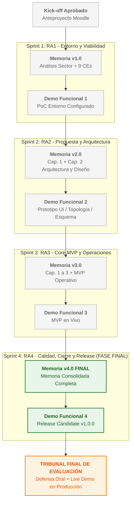
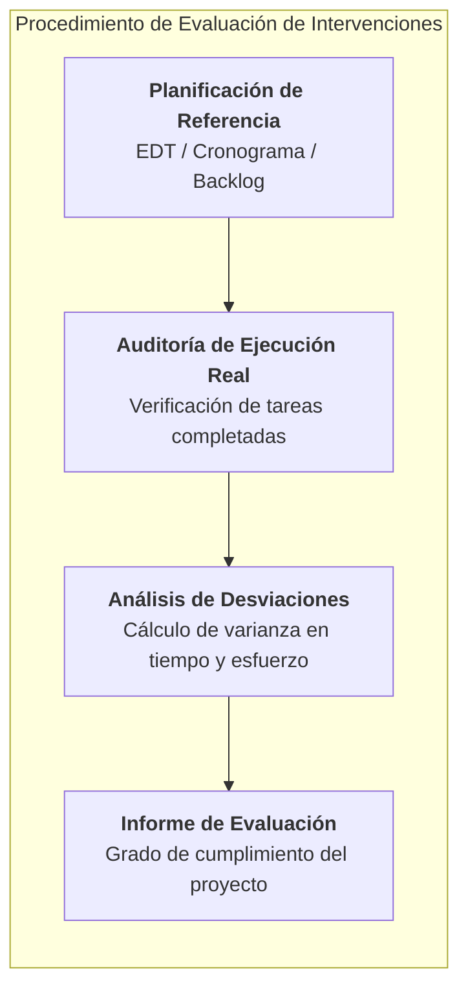
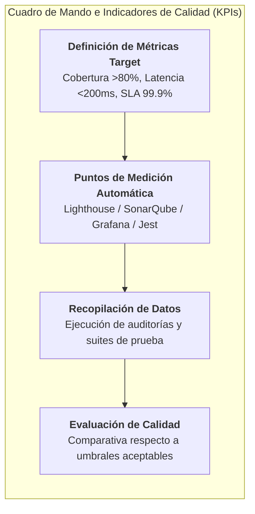
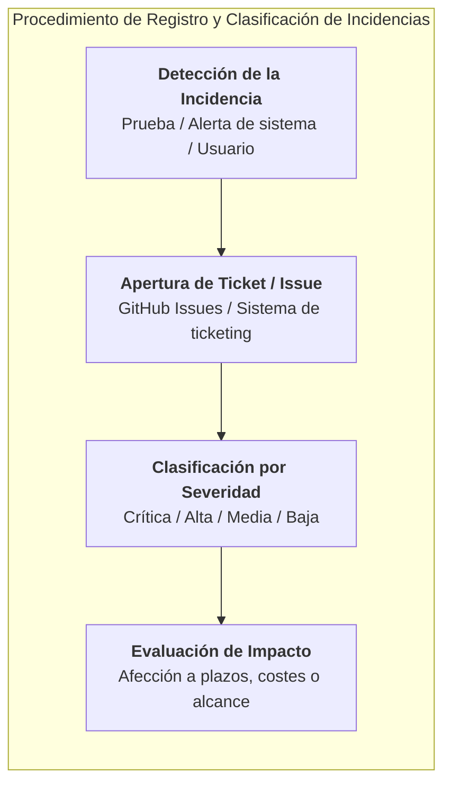
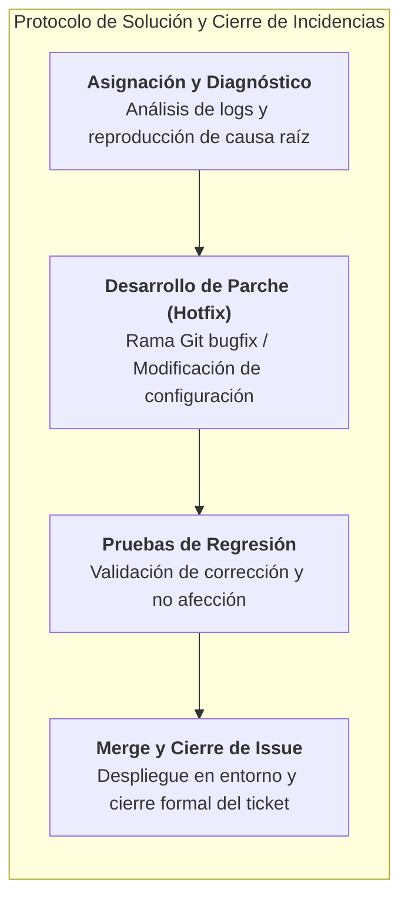
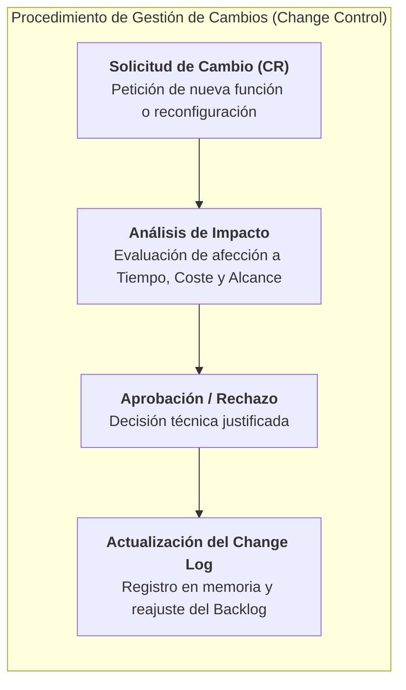
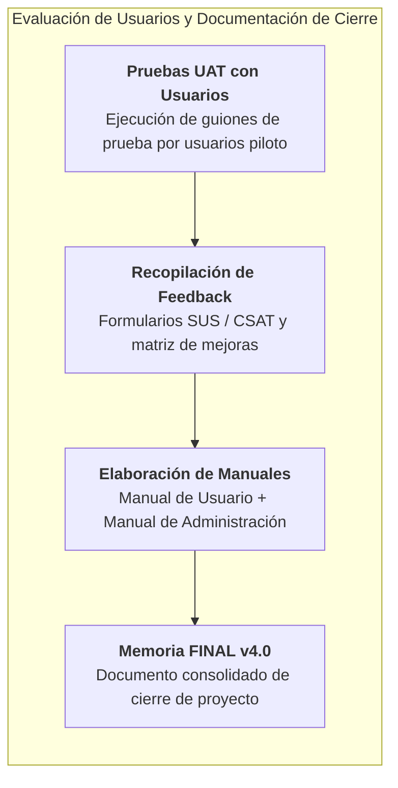

# 🚀 Guía Metodológica: RA4 — Control de Calidad, Gestión de Incidencias, Seguimiento y Cierre del Proyecto

> **Módulo Profesional:** Proyecto Intermodular / Proyecto Integrado (DAM / DAW / ASIR)  
> **Ámbito:** Cualquier Tipología de Proyecto Tecnológico (Desarrollo Software Web/Móvil/Desktop, Infraestructura Cloud/On-Premise, Redes Nacionales e Internacionales, Ciberseguridad/SOC, Data/IA, IoT o Sistemas Embebidos)  
> **Fase del Proyecto:** Sprint 4 (FASE FINAL) | **Entregable:** Memoria Consolidada FINAL v4.0 + Release Candidate v1.0.0 + Defensa ante Tribunal  
> **Rol del Alumno/a:** *Architect / Technical Lead / Lead Developer / DevOps / SecOps / SysAdmin* (Responsable Único del Proyecto)  
> **Rol del Docente:** *Guía Metodológico, Orientador Técnico y Evaluador / Tribunal*

---

## 📋 Índice
1. [Enfoque del Proyecto (Sprint 4 — Control de Calidad, Despliegue, Cierre y Evaluación Final)](#1-enfoque-del-proyecto-sprint-4--control-de-calidad-despliegue-cierre-y-evaluación-final)
2. [Ciclo de Vida Incremental del Proyecto (Fase RA4)](#2-ciclo-de-vida-incremental-del-proyecto-fase-ra4)
3. [Prerrequisito Obligatorio: Consolidación del Sprint 3 (Core MVP)](#3-prerrequisito-obligatorio-consolidación-del-sprint-3-core-mvp)
4. [Desglose Criterio por Criterio (CE.a al CE.f)](#4-desglose-criterio-por-criterio-cea-al-cef)
   - [CE.a — Procedimiento de Evaluación de las Actividades e Intervenciones Realizadas](#ce-a--procedimiento-de-evaluación-de-las-actividades-e-intervenciones-realizadas)
   - [CE.b — Definición e Identificación de Indicadores de Calidad y Métricas](#ce-b--definición-e-identificación-de-indicadores-de-calidad-y-métricas)
   - [CE.c — Registro, Clasificación y Evaluación de Incidencias y Desviaciones](#ce-c--registro-clasificación-y-evaluación-de-incidencias-y-desviaciones)
   - [CE.d — Procedimiento y Protocolo para la Solución de Incidencias Registradas](#ce-d--procedimiento-y-protocolo-para-la-solución-de-incidencias-registradas)
   - [CE.e — Gestión y Registro de Cambios en Recursos, Alcance y Tareas (Change Management)](#ce-e--gestión-y-registro-de-cambios-en-recursos-alcance-y-tareas-change-management)
   - [CE.f — Evaluación de Usuarios, Pruebas UAT, Feedback y Documentación Específica](#ce-f--evaluación-de-usuarios-pruebas-uat-feedback-y-documentación-específica)
5. [Ejecución Práctica del Despliegue, Release y Defensa (Demo Funcional 4 y Tribunal)](#5-ejecución-práctica-del-despliegue-release-y-defensa-demo-funcional-4-y-tribunal)
6. [Matriz de Entregables en Moodle y Defensa ante Tribunal (Sprint 4)](#6-matriz-de-entregables-en-moodle-y-defensa-ante-tribunal-sprint-4)
7. [Checklist de Autoevaluación para el Alumnado (Sprint 4)](#7-checklist-de-autoevaluación-para-el-alumnado-sprint-4)

---

## 1. Enfoque del Proyecto (Sprint 4 — Control de Calidad, Despliegue, Cierre y Evaluación Final)

En esta cuarta y última fase del proyecto, el alumno/a culmina la ejecución técnica alcanzando el estado **Release Candidate v1.0.0**, consolidando la **Memoria Final v4.0** y realizando el **control de calidad integral, gestión de cambios, pruebas con usuarios (UAT) y defensa oral ante el Tribunal**.

Cualquiera que sea la especialidad del estudiante, el Sprint 4 requiere validar la solución en entorno de producción o simulación real, medir los indicadores de calidad establecidos y gestionar de forma procedimentada cualquier incidencia o cambio acontecido:

### 📱 Desarrollo de Software Multiplataforma (DAM)
* **Generación de Builds Finales:** Compilación de binarios de producción (`.apk` / `.aab` firmados para Android, `.ipa` para iOS, instaladores de escritorio ejecutable).
* **Pruebas de Calidad y Rendimiento:** Auditoría de cobertura de código, pruebas de estrés en dispositivo real y análisis de memoria (*leak detection*).
* **Gestión de Bugs y Cambios:** Clasificación de incidencias de UI/UX, parches de estabilidad y registro de cambios en el tablero Kanban.
* **Pruebas de Aceptación de Usuario (UAT):** Sesiones de prueba con usuarios finales reales, formularios de usabilidad y matriz de trazabilidad de correcciones.
* **Manuales de Usuario y Sistema:** Redacción de la guía de instalación, manual de usuario final y documentación de la arquitectura consolidada.

### 🌐 Desarrollo de Aplicaciones Web (DAW)
* **Despliegue en Producción:** Publicación final del entorno web Full-Stack / SaaS en plataforma Cloud o Hosting de producción con dominio/SSL activo.
* **Auditoría de Calidad Web:** Pruebas de rendimiento y accesibilidad (Lighthouse, Web Vitals \(>90\)), análisis de seguridad (OWASP ZAP) y tests E2E (Cypress / Playwright).
* **Control de Incidencias y Trazabilidad:** Registro centralizado de excepciones (Sentry / logs de servidor) y protocolo de despliegue de parches (*hotfixes*).
* **Evaluación de Usuarios (UAT):** Pruebas de usabilidad con clientes piloto, encuestas de satisfacción (CSAT/SUS) y métricas de comportamiento de navegación.
* **Documentación Técnica y API:** Publicación interactiva de la documentación de API (Swagger UI / Redoc) y manuales de administración del sistema.

### 🖥️ Administración de Sistemas Informáticos y Redes (ASIR)
* **Puesta en Producción e Infraestructura Final:** Despliegue final del clúster, infraestructura multi-site o topología de red totalmente bastionada y en alta disponibilidad.
* **Auditoría de Sistemas y Seguridad:** Auditoría de bastionado (CIS Benchmarks), escaneo de vulnerabilidades (OpenVAS/Nessus), pruebas de conmutación por error (*failover*) y rendimiento de red.
* **Gestión de Incidencias de Sistemas:** Monitorización de alertas automatizadas (Prometheus / Grafana / Zabbix), libro de incidencias operativas y matriz de resolución.
* **Pruebas con Usuarios y Gestión del Cambio:** Validación del acceso de usuarios finales a los servicios (VPN, SSO, VDI), gestión de solicitudes de cambio de configuración e impacto en producción.
* **Manuales Operativos y Disaster Recovery:** Redacción del Manual de Operaciones de Sistemas (SOP), Guía de Mantenimiento y Plan de Recuperación ante Desastres (DRP).

---

## 2. Ciclo de Vida Incremental del Proyecto (Fase RA4)

El documento del estudiante alcanza su estado definitivo con la **Memoria Consolidada FINAL v4.0**, que integra los Capítulos 1, 2 y 3 revisados y añade el **Capítulo 4 (Seguimiento, Control de Calidad, Gestión de Incidencias, Cierre y Conclusiones)**.

---

## 3. Prerrequisito Obligatorio: Consolidación del Sprint 3 (Core MVP Operativo)

Para poder abordar con garantías las actividades de control de calidad, evaluación de usuarios y cierre del Sprint 4, el alumno/a debe haber superado y consolidado los hitos del Sprint 3:

1. **MVP Funcional Validado:** Las funcionalidades clave o componentes principales de la infraestructura deben estar completamente construidos y operativos en el entorno de desarrollo/pre-producción.
2. **Memoria v3.0 Corregida:** Integración de los comentarios y observaciones emitidos por el docente durante la revisión del Sprint 3.
3. **Repositorio Git Actualizado:** Histórico de *commits* limpio con la rama `main` / `master` lista para empaquetar la *Release Candidate v1.0.0*.
4. **Entorno de Pruebas Disponible:** Disponibilidad de un entorno estable (servidor de producción/staging, cluster activo o dispositivo físico/emulador) para la ejecución de pruebas de calidad y sesiones con usuarios.

---

## 4. Desglose Criterio por Criterio (CE.a al CE.f)

Cada Criterio de Evaluación del RA4 representa el **16.67% de la nota total del Sprint 4**.

---

### CE.a — Procedimiento de Evaluación de las Actividades e Intervenciones Realizadas

* **Objetivo Curricular:** Se ha definido el procedimiento de evaluación de las actividades o intervenciones realizadas durante la ejecución del proyecto.
* **Explicación Profunda:** El alumno/a debe establecer un protocolo formal para auditar y evaluar el grado de cumplimiento de las actividades planificadas en la EDT/WBS y en el tablero Kanban. No basta con ejecutar el trabajo; es obligatorio comparar lo planificado con lo ejecutado, analizando desviaciones temporales, procedimentales y de rendimiento técnico.
  * **Elementos del Procedimiento de Evaluación:**
    * *Revisiones de Sprint (Sprint Review / Retrospectiva):* Análisis periódico del cumplimiento del DoD (*Definition of Done*) en las tareas del backlog.
    * *Auditoría de Hitos:* Verificación del grado de consecución de los entregables parciales (Memoria v1.0 a v4.0 y Demos Funcionales 1 a 4).
    * *Análisis de Desviaciones:* Cálculo del nivel de cumplimiento del cronograma (días de retraso/adelanto por paquete de trabajo).

* **Ejemplos por Ciclo Formativo:**
  * **DAM:** Evaluación del tiempo real empleado en el desarrollo del módulo de autenticación móvil frente a las horas estimadas en el plan de sprint, analizando causas de retraso en la integración de librerías nativas.
  * **DAW:** Auditoría del ritmo de finalización de endpoints de la API REST mediante gráficos de *Burn-down* en GitHub Projects, comparando las historias de usuario completadas con el compromiso inicial del Sprint.
  * **ASIR:** Verificación del cumplimiento del plan de despliegue de la infraestructura de red, evaluando el número de comandos de configuración y scripts Ansible ejecutados dentro de las ventanas de mantenimiento previstas.

---

### CE.b — Definición e Identificación de Indicadores de Calidad y Métricas

* **Objetivo Curricular:** Se han definido los indicadores de calidad para realizar la evaluación del proyecto.
* **Explicación Profunda:** Establecimiento de un conjunto de indicadores clave de rendimiento y calidad (**KPIs**) cuantitativos y medibles que permitan determinar objetivamente si el producto software o la infraestructura cumple los estándares de ingeniería exigidos.
  * **Categorías de Indicadores de Calidad:**
    * *Métricas de Rendimiento y Eficiencia:* Tiempos de respuesta (latencia), rendimiento de CPU/RAM, uso de ancho de banda y velocidad de carga.
    * *Métricas de Calidad de Código y Mantenibilidad:* Cobertura de pruebas unitarias (% coverage), densidad de defectos (bugs por cada 1.000 líneas de código) y cumplimiento de estándares de linter.
    * *Métricas de Disponibilidad y Fiabilidad:* Porcentaje de tiempo de actividad (*Uptime* SLA \(>99.5\%\)), tiempo medio entre fallos (MTBF) y tiempo medio de reparación (MTTR).
    * *Métricas de Seguridad:* Ausencia de vulnerabilidades críticas/altas en escaneos estáticos (SAST) y dinámicos (DAST).

* **Ejemplos por Ciclo Formativo:**
  * **DAM:** Métricas de tiempo de arranque de la app (*cold start* \(<1.5s\)), consumo de batería en segundo plano, tasa de cuelgues (*crash-free sessions* \(>99\%\)) y cobertura de tests unitarios en la capa de dominio (*coverage* \(>80\%\)).
  * **DAW:** Métricas de Google Web Vitals (Lighthouse Performance \(>90\), LCP \(<2.5s\), CLS \(<0.1\)), latencia media de respuesta de endpoints API \(<150ms\) y cero vulnerabilidades altas en informe OWASP ZAP.
  * **ASIR:** Métricas de tiempo de actividad del clúster de servidores (SLA \(>99.9\%\)), tiempo de convergencia de rutas en la red SD-WAN \(<3s\), latencia inter-sede \(<20ms\) y tiempo de recuperación de servicio tras conmutación de fallos (*failover* \(<10s\)).

---

### CE.c — Registro, Clasificación y Evaluación de Incidencias y Desviaciones

* **Objetivo Curricular:** Se ha definido el procedimiento para el registro y evaluación de las incidencias que puedan presentarse durante la ejecución del proyecto.
* **Explicación Profunda:** Definición de un procedimiento sistemático para capturar, documentar, categorizar y priorizar cualquier fallo, bug, error de configuración o desviación operacional que surja durante las pruebas o despliegues del proyecto.
  * **Flujo de Registro e Identificación:**
    * *Herramientas de Registro:* Utilización de un sistema centralizado de gestión de tickets o incidencias (GitHub Issues, Jira, GitLab Issues o Trello).
    * *Campos Obligatorios del Registro:* ID de la incidencia, fecha/hora, componente afectado, entorno (Dev/Staging/Prod), pasos para reproducir, comportamiento esperado vs. obtenido y capturas/logs de error.
    * *Matriz de Clasificación por Severidad e Impacto:*
      * **Bloqueante / Crítica:** Caída total del sistema, pérdida de datos o brecha de seguridad.
      * **Alta:** Funcionalidad principal rota sin alternativa directa.
      * **Media:** Fallo en funcionalidad secundaria con solución temporal.
      * **Baja / Leve:** Defectos cosméticos, erratas en interfaz o pequeñas mejoras de usabilidad.

* **Ejemplos por Ciclo Formativo:**
  * **DAM:** Registro de un fallo de desbordamiento de memoria (*OutOfMemoryError*) al cargar imágenes de alta resolución en dispositivos con Android 10, categorizado como severidad "Alta" en GitHub Issues.
  * **DAW:** Captura de un error de CORS y fallo de autenticación JWT de frecuencia intermitente en el entorno de Staging, registrado como incidencia "Media" con sus correspondientes cabeceras HTTP de respuesta anexadas.
  * **ASIR:** Alerta automatizada de saturación del uso de disco en el volumen de base de datos (alcanzando el \(92\%\) de capacidad) registrada como ticket de severidad "Alta" en el panel de incidencias de infraestructura.

---

### CE.d — Procedimiento y Protocolo para la Solución de Incidencias Registradas

* **Objetivo Curricular:** Se ha definido el procedimiento para la solución de las incidencias registradas.
* **Explicación Profunda:** Establecimiento del protocolo operativo paso a paso para investigar, corregir, probar y cerrar las incidencias previamente registradas, garantizando que ninguna corrección introduzca nuevos errores (*regresiones*).
  * **Fases del Protocolo de Resolución (Lifecycle de un Bug):**
    1. *Asignación:* Vinculación de la incidencia al responsable técnico correspondiente en el tablero Kanban.
    2. *Diagnóstico y Causa Raíz:* Análisis de logs, depuración (*debugging*) y reproducción del fallo en entorno aislado.
    3. *Desarrollo del Parche / Fix:* Creación de una rama específica de corrección urgente (`bugfix/*` o `hotfix/*`) en Git.
    4. *Verificación y Pruebas de Regresión:* Comprobación de que el parche corrige el error y que la suite de pruebas automatizadas continúa pasando.
    5. *Despliegue y Cierre de Ticket:* Fusión (*merge*) mediante Pull Request y actualización del estado de la incidencia a "Resuelto / Cerrado".

* **Ejemplos por Ciclo Formativo:**
  * **DAM:** Creación de una rama `bugfix/memory-leak-images`, implementación de la librería Glide/Coil con reciclaje automático de mapas de bits, ejecución de pruebas de regresión en emulador y Pull Request a `main`.
  * **DAW:** Modificación del middleware de cabeceras de CORS en la API Backend, verificación local con Postman, despliegue del parche en pre-producción y cierre automático de la issue en GitHub mediante commit `Fixes #34`.
  * **ASIR:** Ejecución de un playbook de Ansible para purgar archivos temporales de logs, ajuste del parámetro de rotación en `logrotate.conf`, verificación del espacio disponible y validación del cierre de la alerta en Grafana.

---

### CE.e — Gestión y Registro de Cambios en Recursos, Alcance y Tareas (Change Management)

* **Objetivo Curricular:** Se ha definido el procedimiento para la gestión y registro de los cambios en los recursos y en las tareas.
* **Explicación Profunda:** Implantación de un proceso formal de **Gestión del Cambio (*Change Management*)** para controlar cualquier modificación en los requisitos iniciales, la asignación de recursos, los plazos de entrega o la arquitectura del proyecto, evitando el crecimiento descontrolado del alcance (*Scope Creep*).
  * **Pasos de la Solicitud de Cambio:**
    * *Solicitud de Cambio (CR - Change Request):* Documentación formal del cambio solicitado, indicando el motivo, la justificación y los componentes afectados.
    * *Análisis de Impacto Tridimensional:* Evaluación de las repercusiones del cambio en **Tiempo** (días de retraso), **Coste** (presupuesto necesario) y **Alcance / Calidad**.
    * *Aprobación / Rechazo:* Decisiones tomadas por el responsable del proyecto (Product Owner / Alumno) en coordinación con el tutor/docente.
    * *Registro de Cambios (Change Log):* Histórico cronológico que recoge todas las solicitudes de cambio aprobadas, su impacto y su fecha de aplicación.

* **Ejemplos por Ciclo Formativo:**
  * **DAM:** Solicitud de incorporación de un modo oscuro (*Dark Mode*) no planificado inicialmente. Se analiza el impacto (2 días adicionales de trabajo de UI), se aprueba posponiendo una función secundaria de exportación a PDF y se registra en la tabla de Cambios.
  * **DAW:** Petición de integración de una pasarela de pago secundaria (PayPal además de Stripe). Tras evaluar el impacto económico y temporal (+15 horas de desarrollo y testing), se rechaza formalmente por no ser viable dentro del sprint actual.
  * **ASIR:** Solicitud de migración del hipervisor de prueba local a una instancia Cloud en AWS debido a límites de hardware en el equipo local. Se evalúa el coste adicional (+12€/mes en OPEX), se aprueba por el tutor y se reajusta el presupuesto consolidado en el registro de cambios.

---

### CE.f — Evaluación de Usuarios, Pruebas UAT, Feedback y Documentación Específica

* **Objetivo Curricular:** Se ha establecido el procedimiento para la participación en la evaluación de los usuarios y se han elaborado documentos específicos.
* **Explicación Profunda:** Diseño e implementación de las **Pruebas de Aceptación de Usuario (UAT - User Acceptance Testing)** y recopilación de retroalimentación (*feedback*) de usuarios finales o clientes piloto. Además, comprende la elaboración de la documentación técnica y de usuario consolidada para el cierre del proyecto.
  * **Componentes de la Evaluación de Usuarios:**
    * *Diseño de Guiones de Pruebas de Usuario:* Escenarios reales de uso donde el usuario final ejecuta tareas cotidianas sin asistencia técnica.
    * *Instrumentos de Recopilación de Feedback:* Cuestionarios normalizados de usabilidad (SUS - *System Usability Scale*), formularios CSAT y registros de observaciones directas.
    * *Documentación Específica del Proyecto:*
      * **Manual de Usuario Final:** Guía gráfica ilustrada con capturas para el manejo del sistema.
      * **Manual de Administración y Operaciones:** Instrucciones de instalación, mantenimiento, copias de seguridad y despliegue.
      * **Memoria Consolidada FINAL v4.0:** Documento completo integrando la totalidad de la ingeniería del proyecto y conclusiones.

* **Ejemplos por Ciclo Formativo:**
  * **DAM:** Realización de pruebas UAT con 5 usuarios piloto evaluando la facilidad de registro y compra en la app móvil. Se obtiene una puntuación promedio SUS de 88/100 y se redacta el Manual de Usuario en formato PDF interactivo.
  * **DAW:** Sesión de pruebas de usabilidad del panel de administración SaaS con el cliente ficticio, midiendo el tiempo de completitud de tareas. Se adjunta el informe de feedback y se entrega la documentación interactiva Swagger API.
  * **ASIR:** Validación de acceso y usabilidad del portal de autenticación VPN y escritorio remoto con un grupo de empleados de prueba. Se recopilan las encuestas de satisfacción de acceso y se elabora el Manual de Operaciones de Sistemas (SOP) y el Plan de Recuperación ante Desastres (DRP).

---

## 5. Ejecución Práctica del Despliegue, Release y Defensa (Demo Funcional 4 y Tribunal)

La **Demo Funcional 4** constituye la prueba presencial final ante el docente/tribunal, donde se presenta el **Release Candidate v1.0.0 totalmente operativo en entorno real o de producción**.

### Detalle de Requisitos de la Demo Funcional 4 por Ámbito Técnico:

#### 1. Proyectos de Desarrollo Software (DAM / DAW)
* **Demostración en Producción:** Ejecución en vivo de la aplicación desplegada en hosting real, dominio público con HTTPS (DAW) o instalada/ejecutada en dispositivo móvil físico (DAM).
* **Validación de Funcionalidades Completa:** Recorrido en directo por el flujo completo de la aplicación (alta de usuario, procesamiento de datos core, persistencia en base de datos de producción y notificaciones/alertas).
* **Verificación de Tolerancia a Fallos:** Demostración en vivo de la gestión de validaciones y respuestas elegantes del sistema ante datos incorrectos o cortes de red.

#### 2. Proyectos de Redes y Telecomunicaciones (ASIR)
* **Demostración de Conectividad y Servicios Real:** Verificación en vivo de la topología de red completa con enlaces activos, redundancia mediante protocolos de enrutamiento dinámico (OSPF/BGP) y túneles VPN IPSec/WireGuard operativos.
* **Prueba de Seguridad y Filtrado:** Demostración en directo del bloqueo de tráfico no autorizado mediante reglas de cortafuegos (pfSense/Fortinet) y detección de ataques en el IDS/IPS.
* **Prueba de Conmutación por Error en Vivo (*Live Failover*):** Desconexión física o lógica del enlace principal de red para demostrar la conmutación automática al enlace de respaldo en menos de 5 segundos sin caída de sesión.

#### 3. Proyectos de Cloud, Virtualización y SysAdmin (ASIR)
* **Despliegue y Alta Disponibilidad en Vivo:** Demostración del clúster de virtualización (Proxmox/K8s) corriendo servicios de producción bajo un balanceador de carga.
* **Prueba de Resiliencia (*Cluster Failover*):** Apagado forzado (*power-off*) de un nodo del clúster en pleno funcionamiento para verificar la migración automática de máquinas virtuales o pods al nodo superviviente sin interrupción del servicio.
* **Cuadro de Mando de Monitorización:** Presentación del panel de Grafana/Prometheus mostrando métricas de salud en tiempo real, alertas de consumo y recepción de avisos por correo/Telegram.

---

## 6. Matriz de Entregables en Moodle y Defensa ante Tribunal (Sprint 4)

A continuación se detalla la matriz oficial de artefactos requeridos para la evaluación final del módulo:

| Entregable | Formato / Plataforma | Contenido Requerido | Criterios Vinculados |
| :--- | :--- | :--- | :--- |
| **Memoria Consolidada FINAL v4.0** | Documento PDF en Moodle | Capítulos 1, 2 y 3 consolidados + Capítulo 4 (Control de Calidad, Indicadores, Registro de Incidencias, Gestión de Cambios, Feedback UAT y Conclusiones). | CE.a, CE.b, CE.c, CE.d, CE.e, CE.f |
| **Release Candidate v1.0.0** | Repositorio Git (GitHub / GitLab) | Código fuente final / IaC en rama `main` etiquetado con Release `v1.0.0`, historial de commits limpio y sin credenciales en duro. | CE.a, CE.d |
| **Manual de Usuario y Operaciones** | PDF / Markdown en Moodle | Manual de usuario ilustrado para clientes finales y Manual de Administración de Sistemas/API para mantenimiento. | CE.f |
| **Cuadro de Mando de Calidad e Incidencias** | Moodle / Tablero Digital | Registro de incidencias cerradas (GitHub Issues), informe de métricas de calidad (Lighthouse / SonarQube / Grafana) y Change Log. | CE.b, CE.c, CE.d, CE.e |
| **Defensa Oral y Demo en Vivo** | Exposición Presencial (10-15 min) | Presentación de diapositivas ejecutiva + Live Demo del sistema en producción en vivo ante el Tribunal de Evaluación. | Todos los CEs del RA1 al RA4 |

---

## 7. Checklist de Autoevaluación para el Alumnado (Sprint 4)

Antes de realizar la entrega final en Moodle y presentarse ante el Tribunal, el estudiante debe verificar el cumplimiento de cada uno de los siguientes puntos:

- [ ] **Consolidación de la Memoria v4.0:** ¿He integrado todas las correcciones previas de los Sprints 1, 2 y 3 en un único documento maestro perfectamente formateado?
- [ ] **Análisis de Desviaciones:** ¿He evaluado el grado de cumplimiento de las actividades planificadas frente al resultado final obtenido?
- [ ] **Verificación de Indicadores de Calidad (KPIs):** ¿He medido y documentado los resultados de calidad (rendimiento, seguridad, cobertura de pruebas, uptime)?
- [ ] **Gestión de Incidencias Completa:** ¿Están todas las incidencias registradas en GitHub Issues con su correspondiente severidad, diagnóstico, solución aplicada y estado "Cerrado"?
- [ ] **Registro de Cambios (*Change Log*):** ¿He documentado todas las modificaciones de alcance, presupuesto o tareas que surgieron durante el desarrollo del proyecto?
- [ ] **Pruebas con Usuarios (UAT):** ¿He realizado sesiones de prueba con usuarios reales y recopilado su feedback mediante cuestionarios o formularios de usabilidad?
- [ ] **Manuales Técnicos y de Usuario:** ¿He elaborado y entregado el Manual de Usuario y el Manual de Operaciones / Mantenimiento de Sistemas?
- [ ] **Tag de Release v1.0.0:** ¿He creado la Release oficial `v1.0.0` en el repositorio Git de producción?
- [ ] **Preparación de la Defensa ante Tribunal:** ¿Tengo ensayada la exposición oral (10-15 min) y comprobado que el entorno de producción funciona en vivo para la Live Demo?
